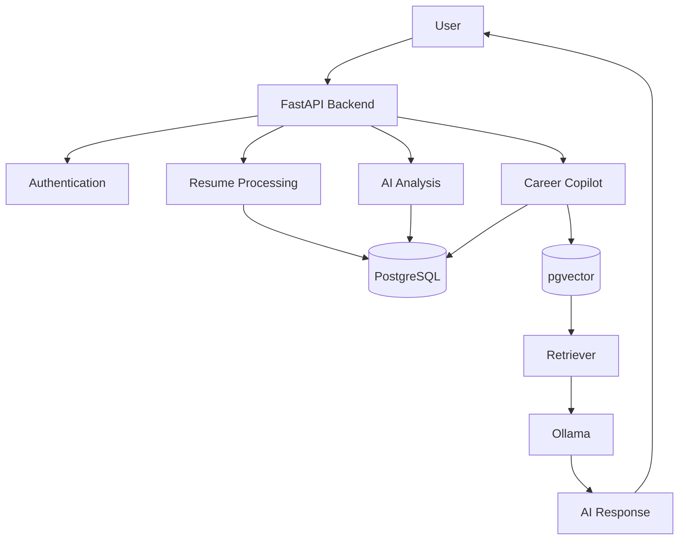

<div align="center">

# 🚀 Career Copilot

### **From Resume to Offer — Powered by AI**

An AI-powered Career Intelligence Backend built with **FastAPI**, **PostgreSQL**, **pgvector**, and **Ollama** that helps users analyze resumes, identify skill gaps, generate personalized learning roadmaps, prepare for interviews, and interact with an intelligent AI assistant using Retrieval-Augmented Generation (RAG).


</div>

---

# 📖 Table of Contents

* [Overview](#-overview)
* [Problem Statement](#-problem-statement)
* [Solution](#-solution)
* [Key Features](#-key-features)
* [Architecture](#-architecture)
* [Technology Stack](#-technology-stack)
* [Quick Start](#-quick-start)
* [Documentation](#-documentation)
* [Project Structure](#-project-structure)
* [Development Timeline](#-development-timeline)
* [Roadmap](#-roadmap)
* [Contributing](#-contributing)
* [License](#-license)

---

# 📖 Overview

Career Copilot is an AI-powered Career Intelligence Backend designed to simplify and personalize the software engineering interview preparation journey.

Instead of relying on generic AI responses, Career Copilot builds a personalized knowledge base for every user by combining information from resumes, job descriptions, AI-generated analyses, learning roadmaps, interview experiences, technical notes, and conversation history.

Using Retrieval-Augmented Generation (RAG), semantic search, and local Large Language Models (LLMs), the platform retrieves relevant contextual information before generating responses, ensuring that every recommendation is grounded in the user's own career data.

Career Copilot acts as an intelligent backend service capable of powering career-focused applications, learning platforms, and AI assistants.

---

# ❗ Problem Statement

Preparing for software engineering roles often requires using multiple disconnected tools.

A typical candidate has to:

* Maintain multiple versions of resumes
* Compare resumes against different job descriptions
* Identify missing technical skills manually
* Search for learning resources independently
* Prepare interview questions from different websites
* Keep scattered interview notes
* Track previous interview experiences
* Ask generic AI assistants that lack personalized context

This fragmented workflow makes interview preparation inefficient and difficult to manage.

---

# 💡 Solution

Career Copilot unifies the entire preparation process into a single AI-powered backend.

The platform enables users to:

* Upload resumes
* Store target job descriptions
* Generate AI-powered skill-gap analyses
* Receive personalized learning roadmaps
* Generate mock interviews
* Save technical notes
* Record interview experiences
* Maintain persistent AI conversations
* Retrieve relevant information using semantic search

By combining structured data with Retrieval-Augmented Generation (RAG), Career Copilot delivers highly personalized career guidance instead of generic responses.

---

# ✨ Key Features

## 🔐 Authentication

* JWT Authentication
* Secure password hashing using bcrypt
* Protected API endpoints
* User-specific data isolation

---

## 📄 Resume Management

* PDF resume upload
* Automatic text extraction
* OCR fallback support
* Resume persistence
* Resume ownership

---

## 💼 Job Description Management

* Store target job descriptions
* User-specific job listings
* Persistent job database

---

## 🤖 AI Resume Analysis

* Resume vs Job Description comparison
* Matched skills detection
* Missing skills identification
* AI-generated recommendations
* Structured JSON responses

---

## 📚 Learning Roadmaps

* AI-generated personalized roadmaps
* Four-week learning plans
* Weekly learning objectives
* Stored as JSON

---

## 🎯 AI Mock Interviews

* Personalized interview questions
* Difficulty-aware questions
* Topic categorization
* JSON-based interview sessions

---

## 🧠 Retrieval-Augmented Generation (RAG)

* Automatic document ingestion
* Intelligent chunking
* Semantic embeddings
* pgvector similarity search
* Context-aware AI responses

---

## 📝 Notes Knowledge Base

* Personal notes
* CRUD operations
* Automatic indexing
* AI-powered retrieval

---

## 💬 Interview Experience Tracker

* Company-wise interview history
* Questions asked
* Interview outcomes
* Lessons learned
* Automatic knowledge base integration

---

## 🤖 Career Copilot

* AI-powered career assistant
* Resume-aware responses
* Roadmap-aware responses
* Interview-aware responses
* Notes-aware responses
* Multi-turn conversations

---

## 🧠 Conversation Memory

* Persistent conversations
* Conversation titles
* Complete chat history
* User-specific conversation management

---

## ⚡ Vector Database

* pgvector integration
* Embedding generation
* Semantic retrieval
* Automatic document indexing
* Knowledge base rebuilding

---

# 🏗 Architecture

> Detailed architecture documentation is available in **docs/ARCHITECTURE.md**



---

# 🛠 Technology Stack

| Category         | Technologies              |
| ---------------- | ------------------------- |
| Backend          | FastAPI, Python           |
| Database         | PostgreSQL                |
| ORM              | SQLAlchemy                |
| Migrations       | Alembic                   |
| Authentication   | JWT, bcrypt               |
| AI               | Ollama                    |
| Embeddings       | nomic-embed-text          |
| Chat Model       | Configurable Ollama Model |
| Vector Search    | pgvector                  |
| Containerization | Docker                    |
| Documentation    | Swagger / OpenAPI         |

---

# ⚡ Quick Start

```bash
git clone https://github.com/<your-username>/career-copilot.git

cd career-copilot

python -m venv .venv

# Windows
.venv\Scripts\activate

# Linux / macOS
source .venv/bin/activate

pip install -r requirements

docker compose up -d

alembic upgrade head

ollama pull llama3.2:3b
ollama pull nomic-embed-text

uvicorn app.main:app --reload
```

Open:

```
http://127.0.0.1:8000/docs
```

to access the interactive Swagger UI.

---

# 📚 Documentation

| Document              | Description                       |
| --------------------- | --------------------------------- |
| docs/SETUP.md         | Complete local installation guide |
| docs/API.md           | Complete API reference            |
| docs/ARCHITECTURE.md  | System architecture               |
| docs/DATABASE.md      | Database schema                   |
| docs/SYSTEM_DESIGN.md | Engineering decisions             |
| docs/TESTING.md       | API testing guide                 |
| docs/DEPLOYMENT.md    | Deployment instructions           |
| docs/ROADMAP.md       | Project development history       |

---

# 📂 Project Structure

```text
career-copilot/

├── app/
│   ├── core/
│   ├── crud/
│   ├── db/
│   ├── models/
│   ├── routers/
│   ├── schemas/
│   ├── services/
│   └── utils/
│
├── alembic/
├── uploads/
├── docs/
├── Dockerfile
├── docker-compose.yml
├── requirements.txt
└── README.md
```

---

# 📈 Development Timeline

The project was developed incrementally using versioned milestones.

Current progress:

* ✅ Authentication
* ✅ Resume Processing
* ✅ Job Description Management
* ✅ AI Resume Analysis
* ✅ Learning Roadmaps
* ✅ Mock Interviews
* ✅ RAG Knowledge Base
* ✅ Vector Search
* ✅ Career Copilot
* ✅ Notes
* ✅ Interview Experiences
* ✅ Persistent Conversation Memory

The complete development history is available in **docs/ROADMAP.md**.

---

# 🚀 Roadmap

Upcoming improvements include:

* Hybrid Retrieval (Vector + Keyword Search)
* Metadata-aware Retrieval
* Streaming AI Responses
* Redis Caching
* Background Workers
* API Rate Limiting
* CI/CD Pipeline
* Cloud Deployment
* Observability & Metrics
* AI Response Evaluation

---

# 🤝 Contributing

Contributions are welcome.

Please read **CONTRIBUTING.md** before opening an issue or submitting a pull request.

---

# 📄 License

This project is licensed under the MIT License.

See the **LICENSE** file for more information.

---

<div align="center">

### ⭐ If you found this project useful, consider giving it a star!

**Career Copilot — From Resume to Offer — Powered by AI**

</div>
