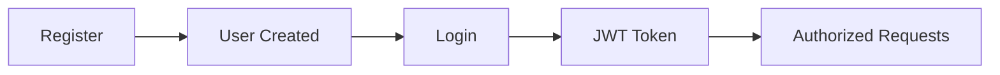
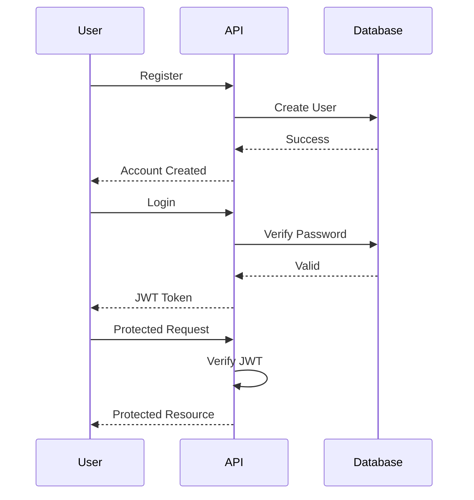
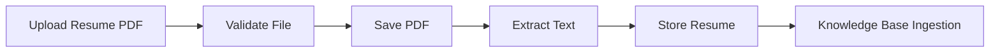
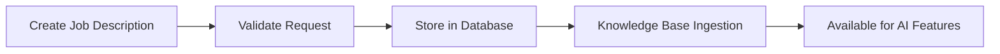
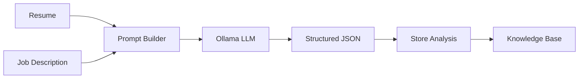
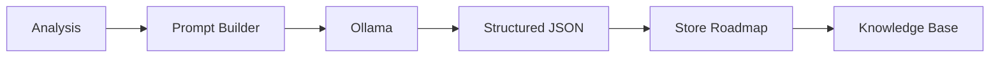
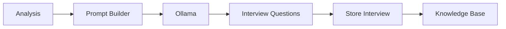
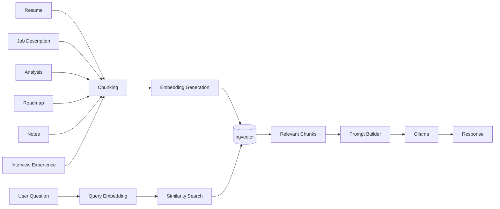
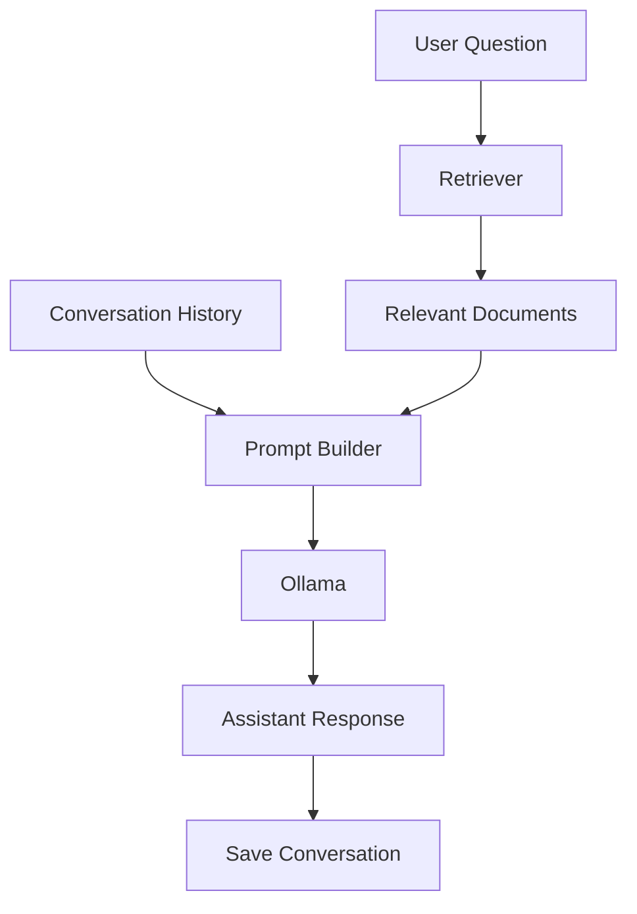
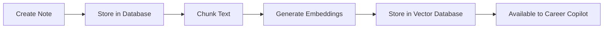

# 🌐 API Documentation

Career Copilot exposes a RESTful API built with **FastAPI**. Every endpoint is documented using **OpenAPI (Swagger UI)** and follows a consistent request and response structure.

Base URL

```
http://127.0.0.1:8000
```

Interactive Swagger Documentation

```
http://127.0.0.1:8000/docs
```

OpenAPI Specification

```
http://127.0.0.1:8000/openapi.json
```

---

# 📚 Table of Contents

* Authentication
* Resume Management
* Job Description Management
* Resume Analysis
* Learning Roadmaps
* Mock Interviews
* Knowledge Base
* Career Copilot
* Notes
* Interview Experiences
* Conversations
* Error Responses

---

# 🔐 Authentication

Authentication is handled using **JWT (JSON Web Tokens)**.

After successful login, every protected endpoint requires the following HTTP header.

```
Authorization: Bearer <access_token>
```

---

# Authentication Flow



---

# Create User

Creates a new user account.

## Endpoint

```
POST /users
```

---

## Authentication

Not Required

---

## Request Body

```json
{
    "name":"John Doe",
    "email":"john@example.com",
    "password":"Password123"
}
```

---

## Successful Response

Status Code

```
201 Created
```

Example

```json
{
    "id":1,
    "name":"John Doe",
    "email":"john@example.com"
}
```

---

## Database Changes

Creates a new record inside the **users** table.

Password is securely hashed using **bcrypt** before storage.

---

## Possible Errors

### Email Already Exists

```
409 Conflict
```

Example

```json
{
    "detail":"Email already registered."
}
```

---

### Invalid Request

```
422 Unprocessable Entity
```

Occurs when

* email is invalid
* password missing
* required fields omitted

---

# Login

Authenticates an existing user.

Returns a JWT access token.

---

## Endpoint

```
POST /login
```

---

## Authentication

Not Required

---

## Request Body

```
Content-Type:
application/x-www-form-urlencoded
```

Example

```
username=john@example.com

password=Password123
```

---

## Successful Response

Status Code

```
200 OK
```

Example

```json
{
    "access_token":"eyJhbGciOiJIUzI1NiIs...",
    "token_type":"bearer"
}
```

---

## Database Changes

No database modifications occur.

---

## JWT Payload

The generated JWT contains

```
User Email

Expiration Time
```

---

## Possible Errors

### Invalid Credentials

```
401 Unauthorized
```

Example

```json
{
    "detail":"Incorrect email or password"
}
```

---

# Get Current User

Returns the authenticated user's profile.

---

## Endpoint

```
GET /me
```

---

## Authentication

Required

```
Authorization: Bearer <token>
```

---

## Successful Response

Status Code

```
200 OK
```

Example

```json
{
    "id":1,
    "name":"John Doe",
    "email":"john@example.com"
}
```

---

## Database Changes

None

---

## Possible Errors

### Missing Token

```
401 Unauthorized
```

---

### Invalid Token

```
401 Unauthorized
```

---

### Expired Token

```
401 Unauthorized
```

---

# Authentication Lifecycle



---

# Security Features

Career Copilot follows modern authentication practices.

✅ Password hashing using bcrypt

✅ JWT authentication

✅ Protected API endpoints

✅ Token expiration

✅ User-specific resource isolation

✅ Password never stored in plain text

---

# Authentication Best Practices

* Never expose your JWT token publicly.
* Always send the token using the Authorization header.
* Do not store passwords in your frontend application.
* Generate a new token by logging in after expiration.
* Use HTTPS in production deployments.

---

# Authentication Example

## Step 1

Create User

```
POST /users
```

↓

## Step 2

Login

```
POST /login
```

↓

## Step 3

Copy JWT

↓

## Step 4

Click **Authorize** in Swagger

↓

## Step 5

Access every protected endpoint.

---

The next section documents Resume Management APIs.

---

# 📄 Resume Management

The Resume Management module is responsible for uploading, storing, and processing user resumes.

Each uploaded resume is associated with a single authenticated user and serves as the primary source of information for AI-powered resume analysis and Retrieval-Augmented Generation (RAG).

After upload, the resume text is automatically extracted and stored in the database for downstream AI processing.

---

# Resume Workflow



---

# Upload Resume

Uploads a PDF resume for the authenticated user.

---

## Endpoint

```http
POST /resumes
```

---

## Authentication

**Required**

```http
Authorization: Bearer <access_token>
```

---

## Content Type

```text
multipart/form-data
```

---

## Request Body

| Field | Type | Required | Description |
| ----- | ---- | -------- | ----------- |
| file  | PDF  | Yes      | Resume PDF  |

---

## Example Request

```bash
curl -X POST \
http://127.0.0.1:8000/resumes \
-H "Authorization: Bearer YOUR_TOKEN" \
-F "file=@resume.pdf"
```

---

## Successful Response

Status Code

```text
201 Created
```

Example

```json
{
    "id": 5,
    "filename": "6a42f2b4-acde-4d56-aabc.pdf",
    "uploaded_at": "2026-06-25T10:25:31"
}
```

---

# What Happens Internally?

The upload pipeline performs the following operations.

1. Validates file type

↓

2. Generates a UUID filename

↓

3. Saves the PDF locally

↓

4. Extracts text from the PDF

↓

5. Uses OCR for scanned documents (if required)

↓

6. Stores extracted text in PostgreSQL

↓

7. Associates resume with the authenticated user

↓

8. Makes the resume available for AI analysis

---

# Database Changes

Affected tables

* resumes

---

Stored Information

* Original filename
* Unique filename
* File path
* Extracted resume text
* Upload timestamp
* User ID

---

# Validation Rules

Accepted format

```text
PDF only
```

Maximum uploads

```text
Unlimited
```

Ownership

```text
Each resume belongs to exactly one user.
```

---

# Possible Errors

## Missing Authentication

```text
401 Unauthorized
```

---

## Invalid File

```text
400 Bad Request
```

Example

```json
{
    "detail":"Only PDF files are allowed."
}
```

---

## Validation Error

```text
422 Unprocessable Entity
```

Occurs when

* file missing
* malformed multipart request

---

# AI Processing

After upload, Career Copilot extracts text from the uploaded resume.

Extraction strategy

```text
PDF

↓

Text Extraction

↓

OCR (if needed)

↓

Clean Text

↓

Store in Database
```

The extracted text becomes the primary knowledge source for

* Resume Analysis
* Career Copilot
* Semantic Search
* Future Knowledge Base indexing

---

# Security

Resume ownership is enforced.

Users can only upload resumes to their own account.

No resume is accessible by another authenticated user.

---

# Example Workflow

```text
Login

↓

Upload Resume

↓

Resume Stored

↓

Text Extracted

↓

Ready for Analysis
```

---

# Notes

* Resume files are stored locally.
* Resume text is stored in PostgreSQL.
* Resume ownership is enforced using JWT authentication.
* The extracted text is reused across multiple AI features to avoid repeated parsing.

---

# 💼 Job Description Management

Career Copilot allows users to store target job descriptions.

Job descriptions are later used for

* Resume comparison
* Skill-gap analysis
* Personalized learning roadmaps
* Mock interview generation
* Retrieval-Augmented Generation (RAG)

---

# Job Description Workflow



---

# Create Job Description

Creates a new job description for the authenticated user.

---

## Endpoint

```http
POST /job-description
```

---

## Authentication

Required

```http
Authorization: Bearer <access_token>
```

---

## Request Body

```json
{
    "title":"Backend Developer",
    "description":"We are looking for a Backend Developer with FastAPI, PostgreSQL, Docker, Redis, Kubernetes and AWS experience."
}
```

---

## Request Fields

| Field       | Type   | Required |
| ----------- | ------ | -------- |
| title       | String | Yes      |
| description | String | Yes      |

---

## Successful Response

```text
201 Created
```

Example

```json
{
    "id":2,
    "title":"Backend Developer",
    "description":"We are looking for..."
}
```

---

# Database Changes

Affected table

* job_descriptions

Stored Information

* Title
* Description
* User ID
* Created Timestamp

---

# Validation Rules

Title

* Required

Description

* Required

Ownership

* User specific

---

# Possible Errors

## Unauthorized

```text
401 Unauthorized
```

---

## Validation Error

```text
422 Unprocessable Entity
```

Occurs when

* title missing
* description missing

---

# AI Usage

Every stored job description becomes available to

* Resume Analysis
* Learning Roadmaps
* Interview Generation
* Career Copilot
* Semantic Search

---

# Example Workflow

```text
Login

↓

Create Job Description

↓

Stored in Database

↓

Knowledge Base Updated

↓

Ready for AI Analysis
```

---

# Summary

The Resume and Job Description modules together provide the foundation for every AI-powered feature within Career Copilot.

All downstream intelligence—including resume analysis, personalized learning roadmaps, mock interviews, and Career Copilot—depends on the information collected through these two endpoints.

---

➡️ Next: **Resume Analysis & Skill Gap Detection**
---

# 🤖 Resume Analysis & Skill Gap Detection

The Resume Analysis module compares a user's uploaded resume against a selected job description using a Large Language Model (LLM).

The generated analysis identifies:

* Existing matching skills
* Missing skills
* Personalized recommendations

The analysis is persisted in the database and automatically indexed into the knowledge base for future Retrieval-Augmented Generation (RAG).

---

# Analysis Workflow



---

# Generate Resume Analysis

Generates an AI-powered comparison between a resume and a job description.

---

## Endpoint

```http
POST /analysis/{resume_id}/{job_id}
```

---

## Authentication

Required

```http
Authorization: Bearer <access_token>
```

---

## Path Parameters

| Parameter | Type    | Description        |
| --------- | ------- | ------------------ |
| resume_id | Integer | Resume ID          |
| job_id    | Integer | Job Description ID |

---

## Example Request

```http
POST /analysis/5/2
```

---

## Successful Response

```text
201 Created
```

Example

```json
{
    "id":2,
    "matched_skills":[
        "Python",
        "FastAPI",
        "PostgreSQL",
        "Docker",
        "JWT Authentication"
    ],
    "missing_skills":[
        "Redis",
        "Kubernetes",
        "CI/CD",
        "Prometheus"
    ],
    "recommendations":[
        "Learn Redis caching.",
        "Study Kubernetes fundamentals.",
        "Practice CI/CD using GitHub Actions.",
        "Build projects demonstrating distributed systems."
    ]
}
```

---

# What Happens Internally?

The endpoint performs the following operations.

1. Validate authenticated user

↓

2. Verify resume ownership

↓

3. Verify job description ownership

↓

4. Load resume text

↓

5. Load job description

↓

6. Build AI prompt

↓

7. Send prompt to Ollama

↓

8. Parse structured JSON

↓

9. Store analysis

↓

10. Index analysis into the knowledge base

---

# Database Changes

Affected tables

* analyses
* documents

---

Stored Information

* Matched skills
* Missing skills
* Recommendations
* Resume ID
* Job Description ID
* User ID

---

# Knowledge Base Impact

The generated analysis is automatically converted into searchable documents.

This allows Career Copilot to answer questions such as:

* What skills am I missing?
* What should I study next?
* Why did the AI recommend Docker?
* Which backend technologies should I prioritize?

without generating another analysis.

---

# Possible Errors

## Resume Not Found

```text
404 Not Found
```

---

## Job Description Not Found

```text
404 Not Found
```

---

## Unauthorized

```text
401 Unauthorized
```

---

## AI Generation Failed

```text
500 Internal Server Error
```

Occurs if

* Ollama is not running
* Chat model unavailable
* Invalid AI response

---

# Example Workflow

```text
Upload Resume

↓

Create Job Description

↓

Generate Analysis

↓

Analysis Stored

↓

Knowledge Base Updated
```

---

# 📚 Learning Roadmaps

Learning Roadmaps transform the generated skill-gap analysis into a personalized learning plan.

Each roadmap contains structured weekly learning goals that guide users toward becoming better candidates for their target role.

---

# Roadmap Workflow



---

# Generate Learning Roadmap

Generates a personalized learning roadmap using an existing analysis.

---

## Endpoint

```http
POST /roadmaps/{analysis_id}
```

---

## Authentication

Required

---

## Path Parameters

| Parameter   | Type    |
| ----------- | ------- |
| analysis_id | Integer |

---

## Successful Response

```text
201 Created
```

Example

```json
{
    "id":1,
    "weeks":[
        {
            "week":1,
            "topics":[
                "Redis",
                "Docker"
            ],
            "projects":[
                "Build a Redis-powered cache"
            ]
        },
        {
            "week":2,
            "topics":[
                "CI/CD",
                "GitHub Actions"
            ]
        }
    ]
}
```

---

# Internal Workflow

1. Load analysis

↓

2. Build roadmap prompt

↓

3. Generate roadmap using AI

↓

4. Parse JSON

↓

5. Store roadmap

↓

6. Index roadmap into the knowledge base

---

# Database Changes

Affected tables

* roadmaps
* documents

---

# Knowledge Base Impact

Roadmaps become searchable.

Career Copilot can answer:

* What should I learn this week?
* Explain Week 2.
* Summarize my roadmap.
* Which projects should I build first?

---

# Possible Errors

* Analysis not found
* Unauthorized
* AI generation failed

---

# Example Workflow

```text
Analysis

↓

Roadmap

↓

Knowledge Base

↓

Career Copilot
```

---

# 🎯 Mock Interviews

Career Copilot generates personalized interview questions using the previously generated skill-gap analysis.

Questions are tailored to the user's current skills and target job.

---

# Interview Generation Workflow



---

# Generate Mock Interview

Creates a personalized interview session.

---

## Endpoint

```http
POST /interviews/{analysis_id}
```

---

## Authentication

Required

---

## Path Parameters

| Parameter   | Type    |
| ----------- | ------- |
| analysis_id | Integer |

---

## Successful Response

```json
{
    "id":1,
    "questions":[
        {
            "topic":"Redis",
            "difficulty":"Medium",
            "question":"Explain Redis persistence mechanisms."
        },
        {
            "topic":"FastAPI",
            "difficulty":"Easy",
            "question":"Explain dependency injection in FastAPI."
        }
    ]
}
```

---

# Database Changes

Affected tables

* interviews

---

Stored Information

* Topic
* Difficulty
* Question
* Analysis ID
* User ID

---

# AI Usage

Questions are generated using

* Resume
* Job Description
* Skill Gap Analysis

to produce highly personalized interview preparation.

---

# Possible Errors

* Analysis not found
* Unauthorized
* AI generation failure

---

# Summary

The Analysis, Roadmap, and Interview modules form the AI core of Career Copilot.

These modules work together to transform raw resume data into personalized career guidance.

The generated outputs are persisted and indexed into the knowledge base, allowing the Career Copilot assistant to reference them in future conversations without regenerating AI responses.

---

➡️ Next: **Knowledge Base, Vector Search & Career Copilot APIs**
---

# 🧠 Knowledge Base

The Knowledge Base is the intelligence layer of Career Copilot.

Instead of querying raw database tables directly, Career Copilot converts user data into semantic vector embeddings, enabling intelligent Retrieval-Augmented Generation (RAG).

Every supported resource is automatically indexed into the vector database.

Current supported sources include:

* Resume
* Job Description
* Resume Analysis
* Learning Roadmap
* Personal Notes
* Interview Experiences

This architecture allows Career Copilot to answer questions using semantic similarity instead of exact keyword matching.

---

# Knowledge Base Architecture



---

# Rebuild Knowledge Base

Reindexes every supported document for the authenticated user.

This endpoint is useful when:

* Changing chunking strategy
* Updating embedding models
* Migrating AI models
* Regenerating embeddings
* Repairing corrupted vector data

---

## Endpoint

```http
POST /documents/reindex
```

---

## Authentication

Required

---

## Request Body

None

---

## Successful Response

```text
200 OK
```

Example

```json
{
    "message":"Knowledge base successfully rebuilt."
}
```

---

# Internal Workflow

```text
Delete Existing Documents

↓

Load Resume

↓

Load Job Descriptions

↓

Load Analyses

↓

Load Roadmaps

↓

Load Notes

↓

Load Interview Experiences

↓

Chunk Documents

↓

Generate Embeddings

↓

Store Vectors
```

---

# Database Changes

Affected tables

* documents

Old vectors are removed.

Fresh embeddings are generated.

---

# Possible Errors

## Unauthorized

```text
401 Unauthorized
```

---

## Embedding Model Failure

```text
500 Internal Server Error
```

Occurs when

* Ollama is offline
* Embedding model unavailable
* Vector generation fails

---

# Knowledge Sources

Career Copilot currently indexes the following resources.

| Source                | Indexed |
| --------------------- | ------- |
| Resume                | ✅       |
| Job Description       | ✅       |
| Analysis              | ✅       |
| Roadmap               | ✅       |
| Notes                 | ✅       |
| Interview Experiences | ✅       |

---

# 💬 Career Copilot

Career Copilot is an AI-powered assistant built using Retrieval-Augmented Generation (RAG).

Unlike traditional chatbots, Career Copilot retrieves relevant information from the user's personal knowledge base before generating responses.

Every conversation is persistent and user-specific.

---

# Career Copilot Workflow



---

# Chat with Career Copilot

Creates or continues an AI conversation.

---

## Endpoint

```http
POST /copilot/chat
```

---

## Authentication

Required

---

## Request Body

```json
{
    "conversation_id":null,
    "message":"Can you summarize my resume?"
}
```

---

### Request Fields

| Field           | Required | Description              |
| --------------- | -------- | ------------------------ |
| conversation_id | No       | Existing conversation ID |
| message         | Yes      | User message             |

If

```text
conversation_id = null
```

Career Copilot automatically creates a new conversation.

---

# Continue Existing Conversation

```json
{
    "conversation_id":4,
    "message":"What should I improve?"
}
```

---

## Successful Response

```json
{
    "conversation_id":4,
    "title":"Can you summarize my resume?",
    "message":"Based on your resume, your strongest skills include FastAPI, PostgreSQL, Docker and JWT Authentication..."
}
```

---

# Internal Workflow

```text
Receive User Message

↓

Load Conversation

↓

Retrieve Recent Chat History

↓

Generate Query Embedding

↓

Semantic Search

↓

Retrieve Relevant Documents

↓

Build Prompt

↓

Generate AI Response

↓

Store User Message

↓

Store Assistant Message

↓

Return Response
```

---

# Database Changes

Affected tables

* conversations
* chat_messages

No new AI analysis is generated.

The assistant simply retrieves existing knowledge.

---

# Knowledge Sources Used

Depending on the user's question, Career Copilot may retrieve information from:

* Resume
* Job Description
* Resume Analysis
* Learning Roadmap
* Personal Notes
* Interview Experiences

---

# Conversation Memory

Every conversation stores

* User messages
* Assistant responses
* Conversation title
* Creation timestamp
* Last updated timestamp

This allows Career Copilot to support multi-turn conversations.

---

# Conversation Creation

If

```json
{
    "conversation_id":null
}
```

Career Copilot automatically

* creates a new conversation
* generates a title
* stores the first user message
* stores the assistant response

---

# Continue Conversation

If

```json
{
    "conversation_id":2
}
```

Career Copilot

* loads conversation
* loads previous messages
* retrieves new context
* generates a context-aware response
* stores the latest exchange

---

# Example Questions

Career Copilot supports questions such as

* Summarize my resume.
* What are my strongest technical skills?
* Which skills am I missing?
* Explain my learning roadmap.
* Which interview questions have I struggled with?
* Summarize my interview experiences.
* What should I study this week?
* Based on everything you know about me, create a preparation plan.

---

# Possible Errors

## Conversation Not Found

```text
404 Not Found
```

---

## Unauthorized

```text
401 Unauthorized
```

---

## AI Failure

```text
500 Internal Server Error
```

Occurs when

* Ollama unavailable
* Chat model missing
* Invalid AI response

---

# Why RAG?

Traditional LLMs answer using only their pre-trained knowledge.

Career Copilot instead performs:

```text
User Question

↓

Retrieve Personal Context

↓

Generate AI Response
```

This makes every response

* Personalized
* Context-aware
* Grounded in user data
* Consistent across conversations

---

# Summary

The Knowledge Base and Career Copilot together transform Career Copilot from a collection of CRUD APIs into an intelligent AI platform.

Rather than generating generic answers, the assistant retrieves semantically relevant information from the user's own career data before generating responses, providing highly personalized guidance.

---

➡️ Next: **Notes, Interview Experiences, Conversations & Error Responses**
---

# 📝 Notes API

The Notes module allows users to store personal learning notes that become part of their AI knowledge base.

Unlike traditional note-taking applications, every note is automatically embedded and indexed into the vector database, allowing Career Copilot to retrieve relevant notes during conversations.

Examples include:

* FastAPI notes
* SQL notes
* Redis concepts
* Docker commands
* Interview preparation notes
* System Design summaries

---

# Notes Workflow



---

# Get All Notes

Returns every note belonging to the authenticated user.

---

## Endpoint

```http
GET /notes
```

---

## Authentication

Required

---

## Successful Response

```json
[
    {
        "id":1,
        "title":"FastAPI",
        "content":"FastAPI supports dependency injection...",
        "created_at":"2026-06-25T12:15:32"
    }
]
```

---

# Get Single Note

Returns one note.

---

## Endpoint

```http
GET /notes/{note_id}
```

---

## Authentication

Required

---

## Path Parameters

| Parameter | Description |
| --------- | ----------- |
| note_id   | Note ID     |

---

# Create Note

Creates a new note.

---

## Endpoint

```http
POST /notes
```

---

## Authentication

Required

---

## Example Request

```json
{
    "title":"Redis",
    "content":"Redis is an in-memory key-value database commonly used for caching."
}
```

---

## Successful Response

```json
{
    "id":5,
    "title":"Redis",
    "content":"Redis is an in-memory key-value database commonly used for caching."
}
```

---

# Internal Workflow

```text
Validate User

↓

Store Note

↓

Chunk Content

↓

Generate Embeddings

↓

Store Vector

↓

Knowledge Base Updated
```

---

# Update Note

Updates an existing note.

---

## Endpoint

```http
PUT /notes/{note_id}
```

---

## Authentication

Required

---

## Example Request

```json
{
    "title":"Redis",
    "content":"Redis supports persistence, pub/sub, streams and caching."
}
```

---

# Internal Workflow

```text
Update Note

↓

Delete Old Embeddings

↓

Chunk Updated Content

↓

Generate New Embeddings

↓

Knowledge Base Updated
```

---

# Delete Note

Deletes a note.

---

## Endpoint

```http
DELETE /notes/{note_id}
```

---

## Authentication

Required

---

# Internal Workflow

```text
Delete Note

↓

Delete Vector Documents

↓

Knowledge Base Updated
```

---

# Database Changes

Affected tables

* notes
* documents

---

# Knowledge Base Impact

Every note immediately becomes searchable by Career Copilot.

Example questions:

* Explain Redis using my notes.
* Summarize my FastAPI notes.
* Which database notes have I written?

---

# 💼 Interview Experience API

Interview Experiences allow users to maintain a personal history of interviews.

Each experience is automatically indexed into the AI knowledge base.

This enables Career Copilot to answer questions such as

* Which companies have I interviewed with?
* Which DSA questions have I seen?
* What mistakes have I repeated?
* Which backend topics appear frequently?

---

# Interview Experience Workflow

```mermaid
flowchart LR

Create Experience

-->

Store Database

-->

Chunk

-->

Embeddings

-->

Knowledge Base

-->

Career Copilot
```

---

# Get Interview Experiences

Returns all interview experiences.

---

## Endpoint

```http
GET /interview-experiences
```

---

## Authentication

Required

---

# Get Interview Experience

Returns a specific interview experience.

---

## Endpoint

```http
GET /interview-experiences/{interview_id}
```

---

# Create Interview Experience

Creates a new interview experience.

---

## Endpoint

```http
POST /interview-experiences
```

---

## Example Request

```json
{
    "company":"Amazon",
    "role":"Software Development Engineer Intern",
    "interview_type":"Technical",
    "interview_date":"2026-06-20",
    "outcome":"Rejected",
    "questions_asked":[
        "Explain HashMap.",
        "Implement LRU Cache."
    ],
    "experience":"The interview focused on DSA and backend fundamentals.",
    "lessons_learned":"Need stronger system design preparation."
}
```

---

## Successful Response

```json
{
    "id":4,
    "company":"Amazon",
    "role":"Software Development Engineer Intern"
}
```

---

# Update Interview Experience

---

## Endpoint

```http
PUT /interview-experiences/{interview_id}
```

---

# Delete Interview Experience

---

## Endpoint

```http
DELETE /interview-experiences/{interview_id}
```

---

# Internal Workflow

```text
Validate User

↓

Store Experience

↓

Convert to Text

↓

Chunk

↓

Generate Embeddings

↓

Knowledge Base Updated
```

---

# Database Changes

Affected tables

* interview_experiences
* documents

---

# AI Usage

Career Copilot retrieves interview experiences to answer questions such as

* What interview questions have I faced before?
* What lessons have I learned?
* Which company interviews went best?
* Which technologies appear repeatedly?

---

# 💬 Conversation API

Career Copilot stores every conversation.

Each conversation contains

* Title
* User
* Messages
* Creation Time
* Last Updated Time

Conversation messages are stored separately.

---

# Get Conversations

Returns every conversation for the authenticated user.

---

## Endpoint

```http
GET /conversations
```

---

## Authentication

Required

---

## Example Response

```json
[
    {
        "id":1,
        "title":"Can you summarize my resume?",
        "updated_at":"2026-06-25T14:32:15"
    },
    {
        "id":2,
        "title":"Help me prepare for Amazon"
    }
]
```

---

# Get Conversation

Returns an entire conversation.

---

## Endpoint

```http
GET /conversations/{conversation_id}
```

---

## Example Response

```json
{
    "id":2,
    "title":"Help me prepare for Amazon",
    "messages":[
        {
            "role":"user",
            "content":"Help me prepare for Amazon."
        },
        {
            "role":"assistant",
            "content":"Based on your resume..."
        }
    ]
}
```

---

# Delete Conversation

Deletes an existing conversation.

---

## Endpoint

```http
DELETE /conversations/{conversation_id}
```

---

# Internal Workflow

```text
Delete Conversation

↓

Delete Chat Messages

↓

Conversation Removed
```

---

# Database Changes

Affected tables

* conversations
* chat_messages

Cascade deletion removes every associated message.

---

# ⚠ Common Error Responses

| Status Code | Description           |
| ----------- | --------------------- |
| 200         | Request Successful    |
| 201         | Resource Created      |
| 204         | Resource Deleted      |
| 400         | Bad Request           |
| 401         | Unauthorized          |
| 404         | Resource Not Found    |
| 409         | Conflict              |
| 422         | Validation Error      |
| 500         | Internal Server Error |

---

# 🔒 Authentication Errors

```json
{
    "detail":"Could not validate credentials."
}
```

---

# 📄 Validation Error

```json
{
    "detail":[
        {
            "loc":["body","title"],
            "msg":"Field required"
        }
    ]
}
```

---

# 🧠 AI Generation Error

```json
{
    "detail":"Failed to generate AI response."
}
```

---

# 📖 API Summary

Career Copilot currently exposes endpoints across the following domains.

| Module                | Purpose                          |
| --------------------- | -------------------------------- |
| Authentication        | User management & JWT            |
| Resume                | Resume upload & extraction       |
| Job Description       | Store target jobs                |
| Analysis              | Skill-gap detection              |
| Roadmap               | Personalized learning plans      |
| Interview             | AI-generated interview questions |
| Knowledge Base        | Vector indexing                  |
| Career Copilot        | AI-powered RAG assistant         |
| Notes                 | Personal learning notes          |
| Interview Experiences | Interview history                |
| Conversations         | Persistent chat memory           |

---

# 🎉 Conclusion

Career Copilot exposes a modular REST API designed around clean architecture principles.

Every module is independently organized, secured using JWT authentication, and integrated with the AI knowledge base where appropriate.

This architecture enables scalable development while providing a personalized AI experience grounded in each user's own career data.


