# 🏗️ System Architecture

Career Copilot is designed using a modular, service-oriented backend architecture that separates business logic, API routing, persistence, AI services, and retrieval into independent layers.

The architecture prioritizes:

* Scalability
* Maintainability
* Separation of Concerns
* Extensibility
* AI Integration
* Clean Code Principles

Unlike traditional CRUD applications, Career Copilot combines conventional backend engineering with Retrieval-Augmented Generation (RAG) to provide personalized AI-powered career guidance.

---

# 📑 Table of Contents

* High-Level Architecture
* Backend Architecture
* Folder Structure
* Request Lifecycle
* Authentication Flow
* Resume Processing Pipeline
* Resume Analysis Pipeline
* Learning Roadmap Pipeline
* Mock Interview Pipeline
* Knowledge Base Pipeline
* RAG Architecture
* Conversation Memory
* Database Architecture
* Service Layer
* Engineering Principles
* Scalability Considerations

---

# 🌍 High-Level Architecture

Career Copilot consists of five major layers.

1. API Layer
2. Business Logic Layer
3. Persistence Layer
4. AI Layer
5. Retrieval Layer

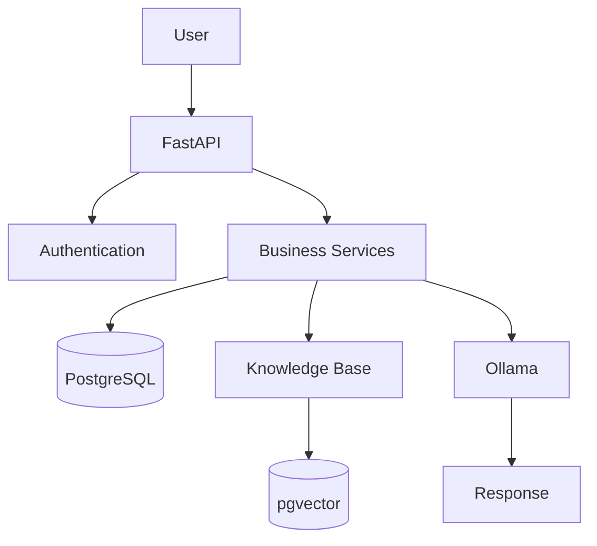

---

# 🏛 Layer Responsibilities

## API Layer

Responsible for

* Receiving HTTP requests
* Request validation
* Dependency Injection
* Authentication
* Response serialization

Technology

* FastAPI
* Pydantic

---

## Business Layer

Contains all application logic.

Responsible for

* Resume processing
* AI analysis
* Roadmap generation
* Interview generation
* CRUD operations
* Conversation management

Location

```text
app/services
```

---

## Persistence Layer

Responsible for

* Database access
* Relationships
* CRUD operations
* Transactions

Technology

* PostgreSQL
* SQLAlchemy
* Alembic

---

## Retrieval Layer

Responsible for

* Chunk retrieval
* Embedding generation
* Semantic similarity search
* Vector indexing

Technology

* pgvector
* Ollama Embeddings

---

## AI Layer

Responsible for

* Resume Analysis
* Roadmap Generation
* Mock Interviews
* Career Copilot

Technology

* Ollama
* Configurable Chat Model

---

# 📂 Backend Folder Structure

```text
app/

├── core/

├── crud/

├── db/

├── models/

├── routers/

├── schemas/

├── services/

├── utils/

└── main.py
```

---

# 📁 Folder Responsibilities

## core/

Contains

* JWT Authentication
* Configuration
* Security
* Dependencies

---

## crud/

Responsible for database operations.

Business logic never interacts directly with SQLAlchemy models.

Instead

```
Router

↓

CRUD

↓

Database
```

This keeps database access centralized.

---

## db/

Contains

* Database Session
* Base Model
* Connection Management

---

## models/

Contains SQLAlchemy ORM models.

Examples

* User
* Resume
* Analysis
* Roadmap
* Interview
* Document
* Conversation

---

## routers/

Contains FastAPI endpoints.

Every feature has its own router.

Examples

```
authentication.py

resume.py

analysis.py

roadmap.py

copilot.py

notes.py
```

---

## schemas/

Contains Pydantic request and response models.

Responsibilities

* Validation
* Serialization
* Documentation

---

## services/

The heart of the project.

Contains

* AI services
* Embedding generation
* RAG
* Retrieval
* Prompt builders
* Resume extraction
* OCR
* Chunking

This layer contains the majority of business logic.

---

## utils/

Contains reusable helper functions.

Examples

* Text cleaning
* Formatting
* Common utilities

---

# 🔄 Request Lifecycle

Every request follows the same architecture.

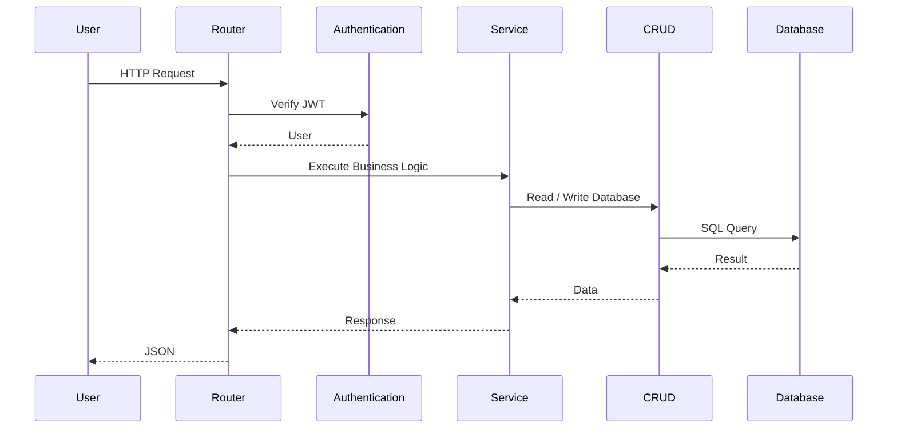

---

# 🎯 Design Philosophy

Career Copilot follows the principle:

> **Routers should orchestrate requests, Services should implement business logic, CRUD should interact with the database, and Models should represent data.**

This separation keeps the codebase modular, testable, and easy to extend.

---

# 🧩 Dependency Injection

FastAPI Dependency Injection is used extensively throughout the project.

Common dependencies include:

* Database Session
* Current Authenticated User
* JWT Authentication

Example request flow:

```
Client Request

↓

Router

↓

Depends(get_db)

↓

Depends(get_current_user)

↓

Business Logic
```

This approach keeps endpoint implementations clean while avoiding repetitive authentication and database setup code.

---

# 🔒 Authentication Architecture

Every protected endpoint requires a valid JWT access token.

Authentication is handled before any business logic is executed.

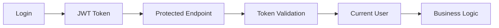
If authentication fails, the request is rejected immediately with an HTTP 401 Unauthorized response.

---

# 🛡️ Authorization Strategy

Career Copilot enforces user-level resource ownership.

Every resource is associated with a specific user through a foreign key relationship.

Examples include:

* Resume
* Job Description
* Analysis
* Roadmap
* Notes
* Interview Experience
* Conversation

Before performing any operation, ownership is verified to prevent unauthorized access to another user's data.

---

# 🔄 Common Request Flow

A typical authenticated request follows this sequence:

1. Client sends request with JWT.
2. FastAPI validates the token.
3. Current user is loaded.
4. Business service executes.
5. Database is queried.
6. Response is returned as JSON.

This consistent flow is used across the entire application, making the backend predictable and easy to maintain.

---

The next section covers the complete **Resume Processing Pipeline**, including PDF upload, text extraction, OCR fallback, and how resume data enters the AI workflow.
---

# 📄 Resume Processing Pipeline

The Resume Processing Pipeline is the entry point into Career Copilot's AI ecosystem.

Every uploaded resume passes through multiple stages before becoming available for AI-powered analysis and semantic retrieval.

The pipeline ensures that resume content is extracted, normalized, persisted, and made available to downstream AI services.

---

# Pipeline Overview


---

# Step 1 — Upload

The authenticated user uploads a PDF resume.

Responsibilities

* Validate authentication
* Validate request
* Validate PDF file

Accepted format

```text
application/pdf
```

---

# Step 2 — Validation

The backend verifies

* file exists
* PDF format
* authenticated user

If validation fails

↓

Request terminates immediately.

---

# Step 3 — Storage

Instead of storing the original filename,

Career Copilot generates a UUID.

Example

```text
resume.pdf

↓

4fb69cb8-acde-48d3-acde.pdf
```

Advantages

* Prevents filename collisions
* Improves security
* Supports duplicate filenames

---

# Step 4 — Text Extraction

Career Copilot extracts readable text from the uploaded PDF.

Pipeline

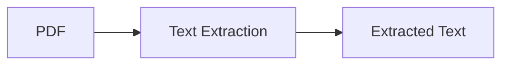

Supported

* Multi-page resumes
* Text-based PDFs

---

# Step 5 — OCR Fallback

If text extraction fails,

Career Copilot automatically attempts OCR.

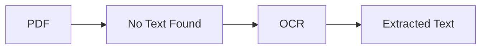

This allows scanned resumes to be processed successfully.

---

# Step 6 — Database Persistence

The extracted information is stored.

Stored fields include

* filename
* extracted text
* upload timestamp
* owner

---

# Step 7 — AI Ready

The resume is now available for

* Resume Analysis
* Career Copilot
* Knowledge Base
* Future Retrieval

No additional processing is required.

---

# Resume Processing Principles

Career Copilot extracts text exactly once.

Instead of repeatedly parsing PDFs,

every downstream AI feature reuses the stored text.

Benefits

✅ Faster AI requests

✅ Lower computational cost

✅ Cleaner architecture

---

# 🤖 Resume Analysis Pipeline

The Resume Analysis Pipeline compares a resume against a selected job description using a Large Language Model.

The output is structured JSON rather than free-form text.

---

# Analysis Architecture

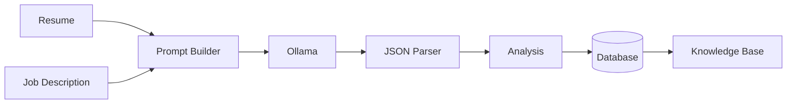

---

# Step 1 — Load Resume

The service loads

* extracted resume text

from PostgreSQL.

---

# Step 2 — Load Job Description

The selected job description is loaded.

Both inputs remain user-specific.

---

# Step 3 — Prompt Construction

The backend builds a structured prompt.

The prompt instructs the LLM to produce

* matched skills

* missing skills

* recommendations

in JSON format.

Prompt engineering significantly improves output consistency.

---

# Step 4 — AI Generation

The prompt is sent to Ollama.

Example models

* llama3.2:3b

* qwen

* configurable local models

The model returns structured JSON.

---

# Step 5 — Validation

The backend validates the generated JSON.

Invalid AI responses are rejected.

This prevents malformed data entering the database.

---

# Step 6 — Persistence

The validated analysis is stored.

Relationships

```text
User

↓

Resume

↓

Analysis

↓

Job Description
```

---

# Step 7 — Knowledge Base Update

The generated analysis becomes searchable.

Career Copilot can later answer

"What skills am I missing?"

without generating another analysis.

---

# 📚 Learning Roadmap Pipeline

The Learning Roadmap converts the AI analysis into an actionable study plan.

---

# Roadmap Architecture

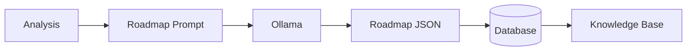

---

# Why Use Analysis Instead of Resume?

Instead of generating a roadmap directly from the resume,

Career Copilot first identifies

* strengths

* weaknesses

* missing skills

The roadmap is therefore focused on improvement rather than repetition.

---

# Roadmap Output

Every roadmap contains

* weekly objectives

* learning topics

* projects

* recommendations

Structured JSON enables easy frontend integration.

---

# Internal Flow

```text
Load Analysis

↓

Prompt Builder

↓

LLM

↓

JSON Validation

↓

Store Roadmap

↓

Knowledge Base
```

---

# 🎯 Mock Interview Pipeline

Interview generation follows a similar workflow.

Rather than asking generic interview questions,

Career Copilot creates questions specifically targeting missing skills.

---

# Interview Generation

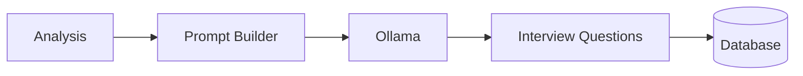
---

# Generated Information

Questions include

* topic

* difficulty

* question

Example

```text
Topic

↓

FastAPI

Difficulty

↓

Medium

Question

↓

Explain FastAPI Dependency Injection.
```

---

# Personalization Strategy

The interview module considers

* resume

* job description

* skill gaps

to maximize interview relevance.

---

# Reusability

Every generated interview is stored.

This prevents repeated AI generation

and allows future retrieval.

---

# AI Workflow Summary
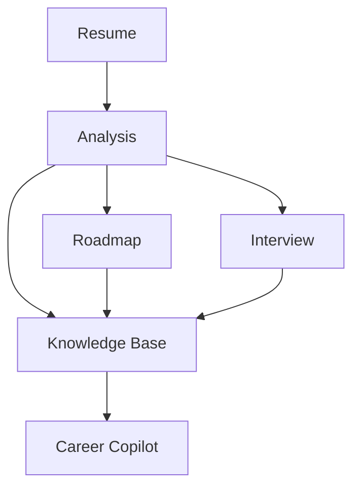

---

# Design Decisions

Why persist AI outputs?

Advantages

✅ Faster responses

✅ Reduced AI calls

✅ Lower inference cost

✅ Searchable history

✅ Better personalization

Instead of regenerating responses every time,

Career Copilot treats AI outputs as long-term knowledge.

---

The next section explains the complete Knowledge Base architecture, semantic retrieval pipeline, vector embeddings, pgvector integration, and Retrieval-Augmented Generation (RAG), which form the core intelligence layer of Career Copilot.
---

# 🧠 Knowledge Base Architecture

The Knowledge Base is the foundation of Career Copilot's Retrieval-Augmented Generation (RAG) system.

Instead of sending an entire database to the Large Language Model (LLM), Career Copilot retrieves only the most relevant pieces of information before generating a response.

This approach provides:

* Personalized responses
* Faster inference
* Lower memory usage
* Better factual grounding
* Reduced hallucinations

Unlike traditional chatbots that rely solely on pre-trained knowledge, Career Copilot reasons over the user's own career data.

---

# Why a Knowledge Base?

Consider the following question:

> **"What backend skills should I improve?"**

A traditional LLM has no knowledge of the user's resume, learning roadmap, interview experiences, or notes.

Career Copilot first retrieves relevant information from the user's personal knowledge base before generating an answer.

This allows the assistant to provide recommendations grounded in the user's own data instead of generic advice.

---

# Knowledge Sources

Career Copilot indexes information from multiple sources.

| Source                | Indexed |
| --------------------- | ------- |
| Resume                | ✅       |
| Job Descriptions      | ✅       |
| Resume Analysis       | ✅       |
| Learning Roadmaps     | ✅       |
| Personal Notes        | ✅       |
| Interview Experiences | ✅       |

Every source contributes to the overall understanding of the user.

---

# Knowledge Base Pipeline

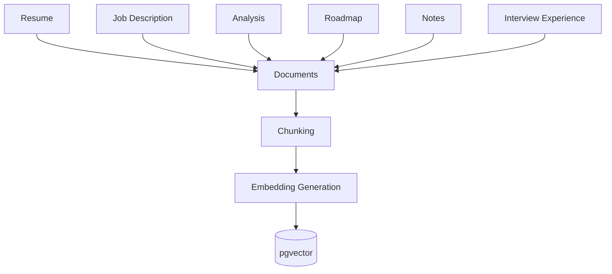

---

# Document Model

Instead of storing vectors directly inside every table,

Career Copilot centralizes searchable content into a dedicated **Document** model.

Each document stores:

* Owner
* Source Type
* Source ID
* Text Chunk
* Vector Embedding

Advantages:

* Single retrieval pipeline
* Uniform indexing strategy
* Easier maintenance
* Extensible architecture

Adding a new knowledge source requires minimal changes to the retrieval layer.

---

# Chunking Strategy

Large documents are divided into smaller chunks before embedding.

Why?

Embedding entire documents reduces retrieval accuracy.

Instead,

Career Copilot stores smaller semantic units.

Example:

```text
Resume

↓

500 Words

↓

Chunk 1

Chunk 2

Chunk 3

Chunk 4
```

Each chunk receives its own embedding.

---

# Why Chunk Documents?

Suppose a resume contains

* Education
* Skills
* Projects
* Experience
* Achievements

A user asks

> "Tell me about my backend projects."

Retrieving only the project-related chunk is significantly more accurate than embedding the entire resume.

---

# Embedding Generation

Every chunk is converted into a dense vector using an embedding model.

Current embedding model

```text
nomic-embed-text
```

Running locally through Ollama.

---

# Embedding Pipeline

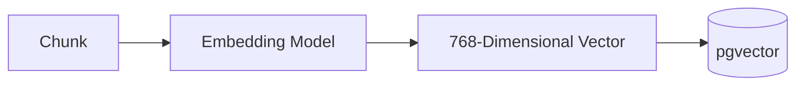

Each chunk becomes a mathematical representation of its meaning.

---

# Why Embeddings?

Traditional search relies on exact keywords.

Example:

Search

```
JWT
```

will not match

```
Authentication Tokens
```

Semantic embeddings understand meaning rather than exact wording.

This significantly improves retrieval quality.

---

# Vector Database

Career Copilot stores embeddings using **pgvector** inside PostgreSQL.

Instead of introducing a separate vector database,

the project keeps both relational data and vectors in the same database.

Advantages:

* Simpler deployment
* Easier backups
* Fewer infrastructure components
* ACID transactions
* SQL + Vector Search together

---

# Retrieval Pipeline

Whenever the user asks a question,

Career Copilot executes the following pipeline.

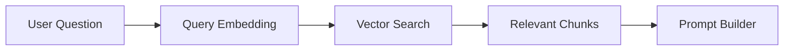

---

# Query Embedding

The user's question is converted into an embedding.

Example:

Question

> "What backend technologies should I learn?"

↓

Embedding

↓

Vector Search

---

# Similarity Search

The generated embedding is compared against every stored document vector.

Career Copilot retrieves only the most similar chunks.

Current strategy:

Top-K semantic similarity search.

Benefits:

* Fast retrieval
* Relevant context
* Scalable architecture

---

# Prompt Construction

After retrieval,

Career Copilot builds a structured prompt.

The prompt contains:

* Relevant knowledge base context
* Conversation history
* Current user question

The LLM never receives the entire database.

Only the most relevant information.

---

# Retrieval-Augmented Generation

The complete RAG workflow.

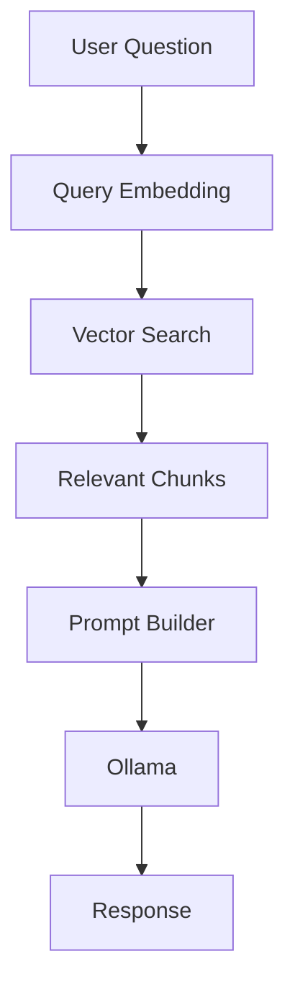

---

# Benefits of RAG

Compared to traditional prompting,

Retrieval-Augmented Generation offers:

✅ Personalized responses

✅ Lower hallucination rate

✅ Faster inference

✅ Better factual grounding

✅ User-specific knowledge

---

# Conversation Memory

Career Copilot supports persistent conversations.

Every conversation contains

* Conversation metadata
* User messages
* Assistant messages
* Conversation title
* Creation timestamp
* Update timestamp

Messages are stored separately from the conversation itself.

---

# Conversation Architecture

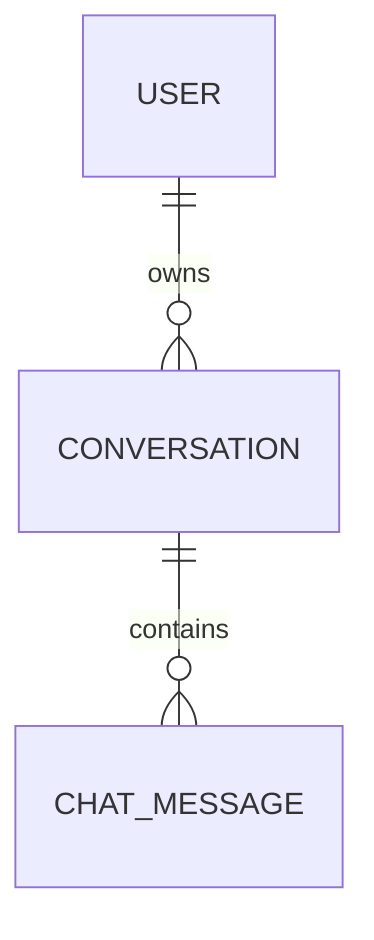

---

# Message Flow

Whenever a user sends a message,

Career Copilot performs the following sequence.

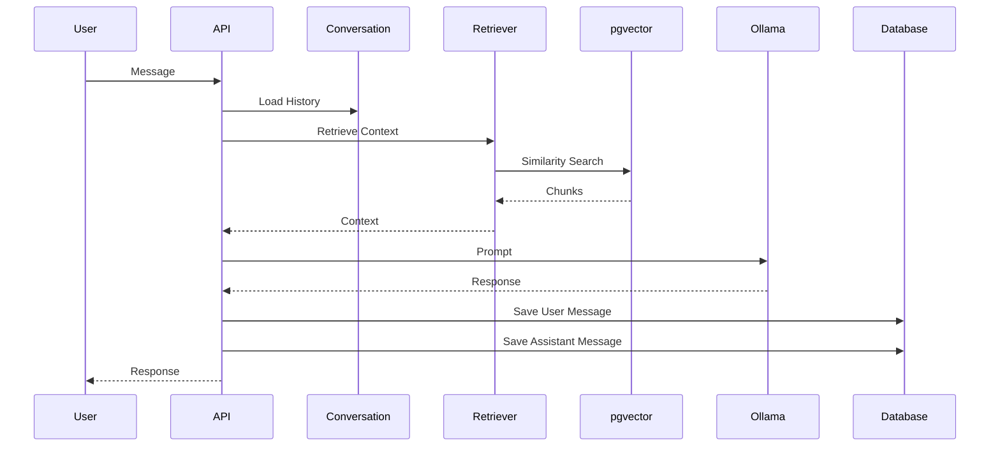

---

# Why Store Conversations?

Persistent conversations provide several benefits:

* Context continuity
* Better user experience
* Historical reference
* Future AI improvements
* Conversation management

Users can resume previous discussions without starting from scratch.

---

# Conversation Titles

Each conversation has a title.

The title is generated from the first user message.

Example

```
How should I prepare for Amazon interviews?
```

↓

Conversation Title

```
How should I prepare for Amazon interviews?
```

This enables a clean sidebar experience and easier conversation management.

---

# Current Limitation

Conversation titles are currently derived from the first message.

In future versions,

the title can be generated automatically using AI for more concise summaries.

---

# Engineering Principles

Career Copilot follows several architectural principles.

## Separation of Concerns

Every module has a single responsibility.

Examples:

* Routers handle HTTP requests.
* Services implement business logic.
* CRUD interacts with the database.
* Models represent data.
* Schemas validate requests.

---

## Modularity

Every feature is isolated.

Examples:

* Notes
* Interviews
* Analysis
* Roadmaps
* Copilot

can evolve independently.

---

## Reusability

Business logic is never duplicated.

Common services include:

* Embedding generation
* Chunking
* Prompt construction
* Retrieval
* Authentication

---

## Extensibility

Adding new AI features requires minimal changes.

Example:

A future **Certifications** module would simply:

1. Store certifications.
2. Convert them into documents.
3. Generate embeddings.
4. Automatically become searchable by Career Copilot.

No changes to the retrieval engine would be required.

---

# Summary

Career Copilot combines modern backend engineering practices with Retrieval-Augmented Generation to build a scalable AI-powered career intelligence platform.

By separating API routing, business logic, persistence, semantic retrieval, and AI generation into independent layers, the system remains modular, maintainable, and easy to extend.

The Knowledge Base, pgvector integration, and persistent conversation memory form the core intelligence layer that enables Career Copilot to deliver personalized, context-aware career guidance grounded in each user's own data.

---

➡️ Next: **Database Architecture, System Design Decisions, Scalability, and Future Architecture**
---

# 🗄️ Database Architecture

Career Copilot uses **PostgreSQL** as its primary database.

Instead of separating relational and vector data into different databases, Career Copilot stores both structured data and vector embeddings inside PostgreSQL using the **pgvector** extension.

This approach simplifies deployment while maintaining powerful semantic search capabilities.

---

# Entity Relationship Overview

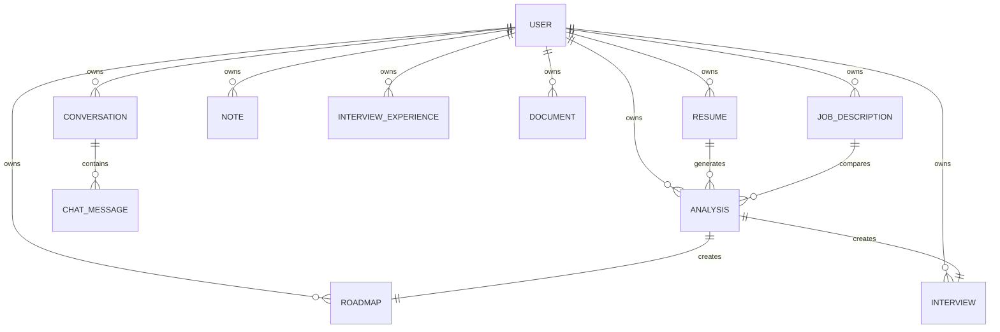

---

# Core Tables

## users

Stores

* Authentication credentials
* User profile
* Relationships to every resource

---

## resumes

Stores

* Uploaded PDF
* Extracted text
* Owner
* Upload timestamp

---

## job_descriptions

Stores

* Target job title
* Description
* Owner

---

## analyses

Stores

* Matched skills
* Missing skills
* Recommendations

Generated once and reused by multiple AI features.

---

## roadmaps

Stores

Personalized learning plans in JSON format.

---

## interviews

Stores

Generated interview questions.

---

## notes

Stores

User-created learning notes.

---

## interview_experiences

Stores

* Company
* Role
* Questions
* Lessons Learned
* Experience

---

## documents

Acts as the semantic knowledge base.

Every searchable document becomes a record inside this table.

Fields include

* source type
* source id
* chunk text
* embedding vector

---

## conversations

Stores

Conversation metadata.

Examples

* title
* owner
* timestamps

---

## chat_messages

Stores

Individual messages.

Fields

* conversation
* sender role
* content
* timestamp

---

# Why PostgreSQL?

Several databases were considered during development.

## PostgreSQL

Advantages

✅ Mature relational database

✅ ACID transactions

✅ Excellent SQL support

✅ JSONB support

✅ pgvector extension

✅ Large ecosystem

---

## Why not MongoDB?

MongoDB excels at document storage but introduces additional complexity for relational data.

Career Copilot relies heavily on relationships between:

* Users
* Resumes
* Analyses
* Roadmaps
* Conversations

These relationships are modeled naturally using PostgreSQL.

---

# Why pgvector?

Instead of introducing an external vector database such as

* Pinecone
* Weaviate
* Qdrant

Career Copilot uses pgvector.

Advantages

✅ Simple setup

✅ One database

✅ Easier deployment

✅ No additional infrastructure

✅ SQL + Semantic Search

---

# Service Layer Architecture

Career Copilot follows a layered architecture.

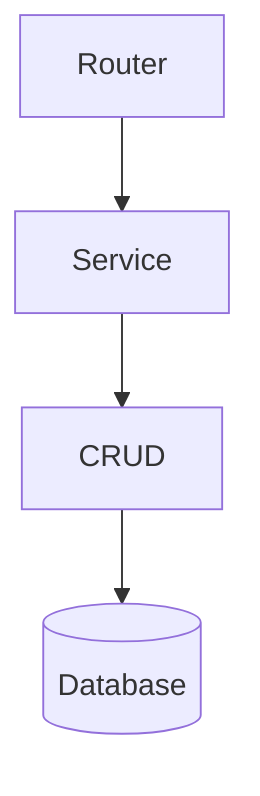

---

# Why Separate Services?

Business logic changes frequently.

Database logic should not.

Separating these concerns allows

* easier testing
* easier maintenance
* reusable AI services
* cleaner code

---

# CRUD Layer

The CRUD layer is responsible only for

* Create
* Read
* Update
* Delete

No AI logic belongs here.

Example

```text
Router

↓

CRUD

↓

Database
```

---

# Service Layer

The Service layer contains

* Resume Parsing
* Chunking
* Embedding Generation
* Retrieval
* Prompt Building
* AI Generation
* Conversation Management

This is where most of Career Copilot's intelligence resides.

---

# Configuration Layer

Configuration is centralized.

Examples

```text
DATABASE_URL

SECRET_KEY

JWT_ALGORITHM

ACCESS_TOKEN_EXPIRE_MINUTES

UPLOAD_DIR

OLLAMA_CHAT_MODEL

OLLAMA_EMBEDDING_MODEL
```

Moving configuration outside the source code simplifies deployment across environments.

---

# Security Considerations

Career Copilot implements several security measures.

## Authentication

JWT-based authentication.

---

## Authorization

User ownership validation for every protected resource.

---

## Password Storage

Passwords are hashed using bcrypt.

Plain-text passwords are never stored.

---

## SQL Injection Protection

SQLAlchemy ORM provides parameterized queries.

---

## File Validation

Resume uploads accept only PDF files.

---

## Conversation Isolation

Users can access only their own conversations.

---

## Knowledge Isolation

Semantic retrieval is always filtered by user.

A user's documents are never retrieved for another user.

---

# Scalability

Career Copilot is designed to scale horizontally.

Current architecture

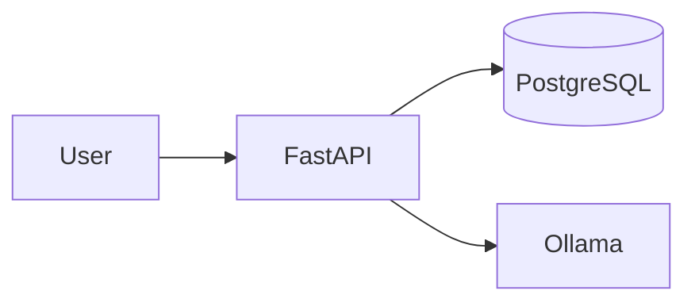
Future architecture

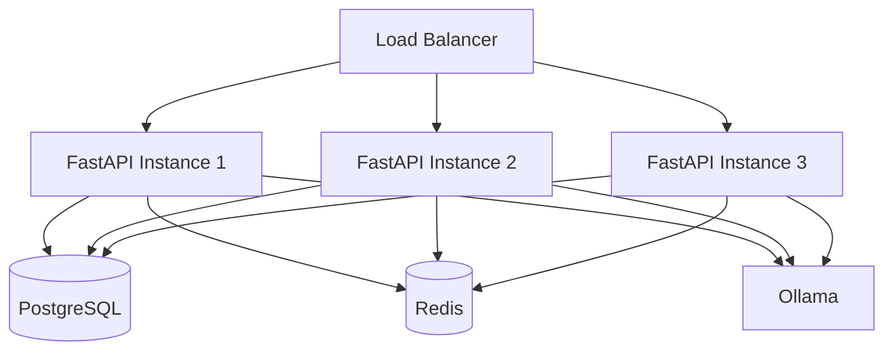
---

# Potential Optimizations

Future versions can introduce

## Redis

* Response caching
* Session caching

---

## Celery

* Background embedding generation
* Long-running AI jobs

---

## Streaming Responses

Server-Sent Events (SSE)

or

WebSockets

for token streaming.

---

## Hybrid Search

Current retrieval

Semantic Search

Future

Semantic Search

*

Keyword Search

---

## Reranking

Introduce a reranker after retrieval.

```text
Retrieve Top 20

↓

Cross Encoder

↓

Top 5

↓

LLM
```

This improves answer quality.

---

## Metadata Filtering

Retrieve documents by

* source type
* date
* conversation
* tags

instead of searching every document.

---

## Observability

Future production deployments may include

* Prometheus
* Grafana
* OpenTelemetry

---

## Rate Limiting

Protect public APIs using

* SlowAPI
* Redis
* API Gateway

---

# Engineering Trade-offs

Several design decisions were made throughout development.

| Decision   | Reason                                                                    |
| ---------- | ------------------------------------------------------------------------- |
| PostgreSQL | Strong relational support and pgvector compatibility                      |
| SQLAlchemy | Mature ORM with excellent migration support                               |
| Alembic    | Version-controlled database schema                                        |
| Ollama     | Local LLM inference without API costs                                     |
| pgvector   | Semantic search within PostgreSQL                                         |
| FastAPI    | High-performance async API framework with automatic OpenAPI documentation |
| Pydantic   | Type-safe validation and serialization                                    |
| Docker     | Reproducible development environment                                      |

---

# Future Vision

Career Copilot has been designed as a foundation for an intelligent career platform.

Possible future modules include

* Company Profiles
* Certification Tracking
* Coding Practice History
* AI Resume Rewriting
* ATS Resume Scoring
* Job Application Tracker
* Interview Scheduling
* Email Integration
* Learning Progress Analytics
* Team Collaboration
* Multi-model AI Routing
* Cloud Deployment

---

# Architectural Highlights

Career Copilot demonstrates several modern backend engineering concepts.

✅ Layered Architecture

✅ Service-Oriented Design

✅ JWT Authentication

✅ SQLAlchemy ORM

✅ Alembic Migrations

✅ Modular FastAPI Routers

✅ Retrieval-Augmented Generation (RAG)

✅ Vector Search with pgvector

✅ Local LLM Integration

✅ Persistent Conversation Memory

✅ Automatic Knowledge Base Construction

✅ Semantic Retrieval

---

# Conclusion

Career Copilot is more than a CRUD backend—it is an AI-powered backend platform that combines modern software engineering principles with Retrieval-Augmented Generation (RAG) to deliver personalized career guidance.

By separating API routing, business logic, persistence, semantic retrieval, and AI generation into independent layers, the platform remains modular, maintainable, and scalable.

The architecture is intentionally designed to support future growth, making it straightforward to add new AI features, knowledge sources, or deployment targets without major structural changes.

Whether used as a learning project, portfolio piece, or foundation for a production system, Career Copilot demonstrates the integration of backend engineering, vector databases, local LLMs, and AI-driven workflows into a cohesive platform.

---


