# Database Design

Career Copilot uses **PostgreSQL** as its primary relational database and **pgvector** for semantic vector search.

The database is designed around three core principles:

* **Data Integrity** through relational modeling and foreign key constraints.
* **User Isolation** to ensure each user's data remains private.
* **AI Readiness** by integrating structured data with a vector-based knowledge base.

---

# Table of Contents

* Database Overview
* Why PostgreSQL?
* Why pgvector?
* Entity Relationship Diagram
* Core Tables
* Relationships
* Indexing Strategy
* Data Flow
* Vector Storage
* Future Improvements

---

# Database Overview

Career Copilot stores two types of information:

1. **Structured Relational Data**
2. **Semantic Vector Data**

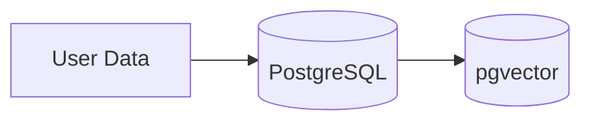

The relational database stores entities such as users, resumes, analyses, and conversations.

The vector database stores semantic embeddings used for Retrieval-Augmented Generation (RAG).

---

# Why PostgreSQL?

PostgreSQL was selected because it provides:

* ACID-compliant transactions
* Excellent relational modeling
* Strong indexing capabilities
* Native JSONB support
* pgvector integration
* Mature ecosystem

These features allow Career Copilot to store both structured application data and vector embeddings within a single database.

---

# Why pgvector?

Rather than introducing a separate vector database, Career Copilot uses the **pgvector** extension.

Benefits include:

* Single database deployment
* Simpler infrastructure
* Reduced operational complexity
* Native SQL queries alongside vector search
* Easier backups and migrations

---

# Entity Relationship Diagram

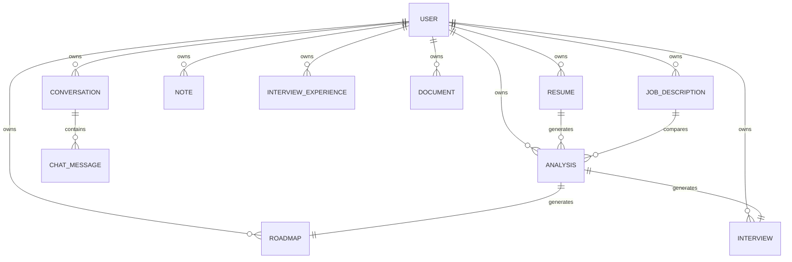

---

# Database Design Principles

Career Copilot follows several design principles.

## User-Centric Data Model

Every major entity belongs to a user.

This provides:

* Resource ownership
* Security
* Simple authorization
* Easier filtering

---

## Separation of Structured and Semantic Data

Structured data remains normalized.

Semantic search operates through the `documents` table.

This keeps the AI layer independent from the business layer.

---

## Reusable Knowledge Base

Instead of embedding every model separately,

Career Copilot converts every supported resource into a common document format.

Advantages:

* Single retrieval pipeline
* Consistent chunking
* Consistent embeddings
* Easy feature expansion

---

# Core Tables Overview

| Table                 | Purpose                          |
| --------------------- | -------------------------------- |
| users                 | Authentication and ownership     |
| resumes               | Uploaded resumes                 |
| job_descriptions      | Target job descriptions          |
| analyses              | AI-generated resume analysis     |
| roadmaps              | Personalized learning plans      |
| interviews            | AI-generated interview questions |
| notes                 | Personal knowledge               |
| interview_experiences | Past interview records           |
| documents             | Vector knowledge base            |
| conversations         | Chat metadata                    |
| chat_messages         | Conversation history             |

---

# User Table

Purpose:

Stores authentication information and acts as the parent entity for all user-owned resources.

## Main Fields

| Field    | Description            |
| -------- | ---------------------- |
| id       | Primary Key            |
| name     | User name              |
| email    | Unique email           |
| password | bcrypt hashed password |

---

# Relationships

A user owns:

* Resumes
* Job Descriptions
* Analyses
* Roadmaps
* Interviews
* Notes
* Interview Experiences
* Documents
* Conversations

---

# Resume Table

Purpose:

Stores uploaded resumes together with extracted text.

## Main Fields

| Field          | Description        |
| -------------- | ------------------ |
| id             | Primary Key        |
| user_id        | Owner              |
| filename       | Stored filename    |
| extracted_text | Parsed resume text |
| created_at     | Upload timestamp   |

---

The extracted text becomes the primary input for multiple AI services.

---

# Job Description Table

Stores target job descriptions.

Each job description belongs to one user and can be reused across multiple analyses.

Main fields include:

* title
* description
* user_id

---

# Analysis Table

Stores AI-generated resume analysis.

Rather than generating the same analysis repeatedly,

Career Copilot persists the result.

Stored information includes:

* matched skills
* missing skills
* recommendations

---

# Roadmap Table

Stores personalized learning roadmaps.

Roadmaps are stored in JSON format.

Each roadmap references a single analysis.

---

# Interview Table

Stores AI-generated interview questions.

Questions are grouped together as an interview session linked to an analysis.

---

# Notes Table

Stores personal notes.

Every note is automatically indexed into the knowledge base.

Examples:

* FastAPI notes
* SQL notes
* Redis notes
* Docker notes

---

# Interview Experience Table

Stores previous interview experiences.

Typical fields include:

* company
* role
* interview type
* interview date
* outcome
* questions asked
* lessons learned

These records enrich the AI knowledge base and improve personalized guidance.

---

# Documents Table

The `documents` table is the heart of the RAG system.

Rather than embedding every model independently, Career Copilot converts all supported resources into documents.

Each document contains:

* user_id
* source_type
* source_id
* chunk_text
* embedding

This unified structure enables a single semantic retrieval pipeline across all knowledge sources.

---

# Conversations Table

Stores conversation metadata.

Fields include:

* id
* user_id
* title
* created_at
* updated_at

---

# Chat Messages Table

Stores every message exchanged with Career Copilot.

Fields include:

* conversation_id
* role
* message
* created_at

Separating conversations from messages keeps the design normalized and allows efficient retrieval of conversation history.

---

The next section covers **relationships, indexing strategy, query optimization, vector storage, and the complete data lifecycle**.
---

# 🔗 Table Relationships

Career Copilot follows a relational database design where every major entity is associated with a specific user.

This ensures:

* Data ownership
* Authorization
* Referential integrity
* Simple querying

---

# User Relationships

The **User** table acts as the parent entity.

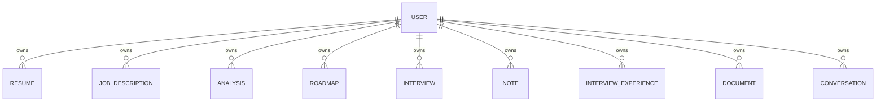

Every resource references the authenticated user through a foreign key.

This guarantees that users cannot access each other's data.

---

# Resume Relationships

A resume belongs to exactly one user.

A resume can generate multiple analyses.

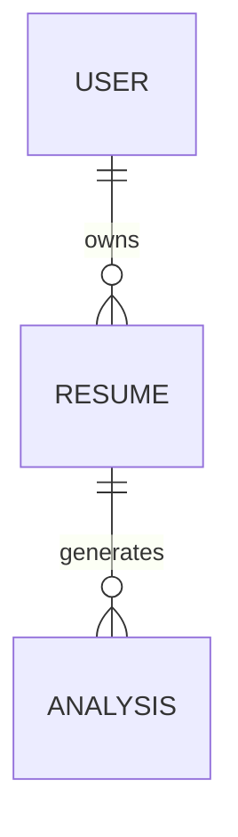

This allows the same resume to be evaluated against different job descriptions.

Example

```text
Resume

↓

Backend Developer

↓

Analysis

Resume

↓

Machine Learning Engineer

↓

Analysis

Resume

↓

DevOps Engineer

↓

Analysis
```

---

# Job Description Relationships

Each job description belongs to a single user.

A job description may be reused for multiple analyses.

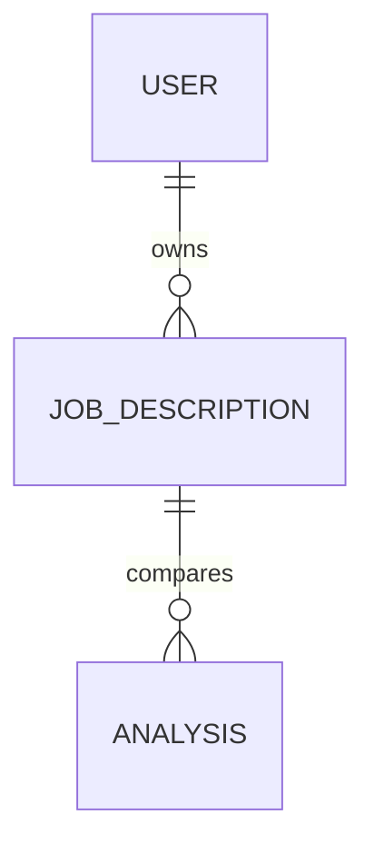

---

# Analysis Relationships

An analysis references both

* Resume
* Job Description

This creates a bridge between the two.

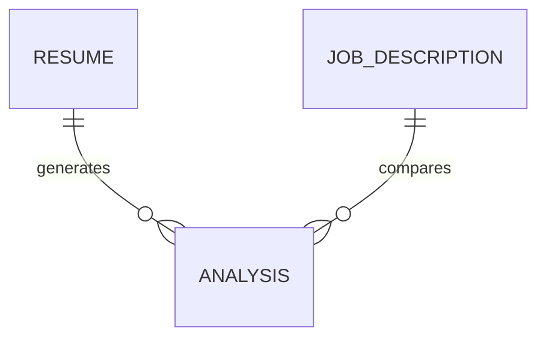

An analysis also becomes the foundation for

* Learning Roadmap
* Mock Interview

---

# Roadmap Relationship

Each roadmap belongs to one analysis.

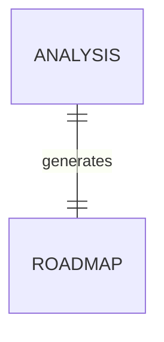

Why?

A roadmap should represent one specific skill-gap analysis.

---

# Interview Relationship

Interview sessions also originate from one analysis.

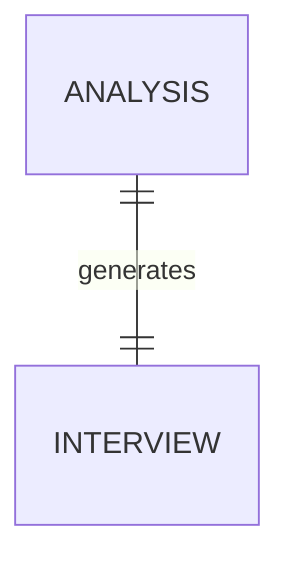

This ensures interview questions remain personalized.

---

# Notes Relationship

Each note belongs to one user.

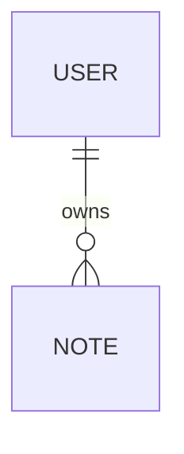

Every note is automatically indexed into the knowledge base.

---

# Interview Experience Relationship

Interview experiences are user-specific.

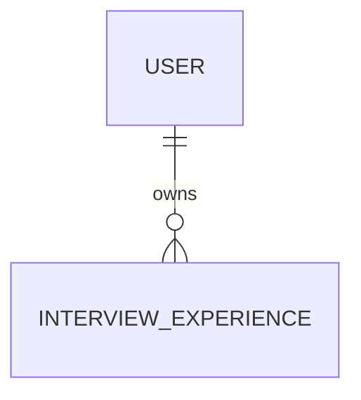

These experiences later become searchable by Career Copilot.

---

# Conversation Relationship

Conversation metadata is separated from individual messages.

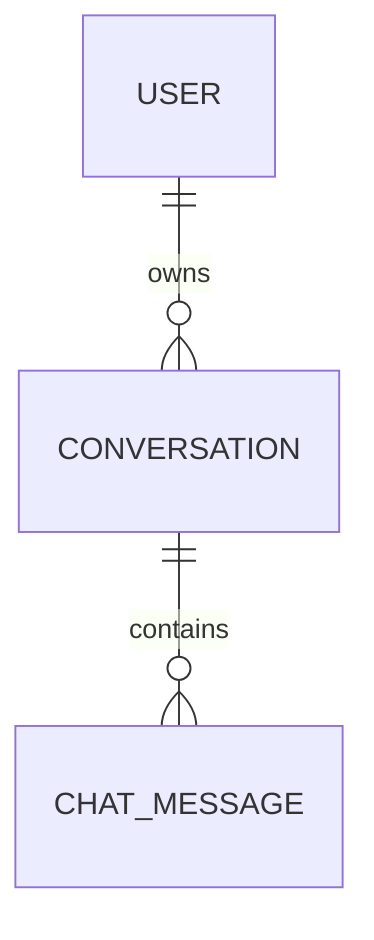

Advantages

* Faster conversation listing
* Efficient history retrieval
* Cleaner normalization

---

# Chat Message Relationship

Each message belongs to one conversation.

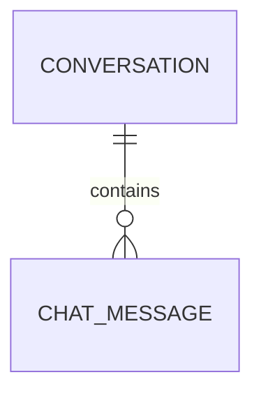

Message roles include

* user
* assistant

---

# Documents Relationship

Every searchable resource generates one or more document chunks.

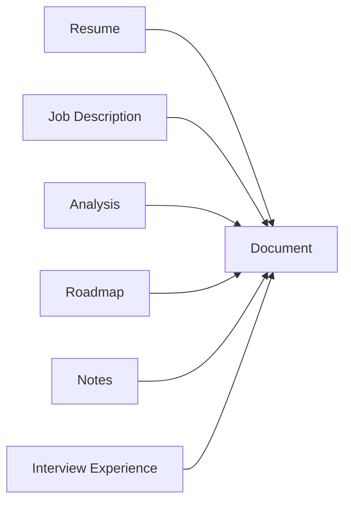

Each document references

* owner
* source type
* source id

This abstraction keeps retrieval generic.

---

#Indexing Strategy

Career Copilot uses database indexes to improve query performance.

Indexed fields include

* Primary Keys
* Foreign Keys
* Frequently searched identifiers

Examples

```text
users.email

resumes.user_id

documents.user_id

documents.source_type

conversations.user_id

chat_messages.conversation_id
```

Indexes reduce lookup time significantly as data grows.

---

# Why Index Foreign Keys?

Almost every API request filters data by user.

Example

```sql
SELECT *

FROM resumes

WHERE user_id = ?
```

Without an index,

PostgreSQL would scan the entire table.

Indexes make these lookups efficient.

---

# Vector Indexing

Semantic search operates on vector embeddings.

Each document stores

```text
Chunk

↓

Embedding

↓

Vector
```

The embedding column uses the pgvector data type.

This enables similarity search using vector distance operators.

---

# Query Optimization

Most application queries follow predictable patterns.

Examples

Retrieve

* Current user's resumes
* Current user's notes
* Current user's conversations
* Documents for semantic retrieval

Because nearly every query filters by user,

the schema is optimized for user-centric access patterns.

---

# Cascade Deletion

Career Copilot uses cascade deletion where appropriate.

Example

```text
Conversation Deleted

↓

Delete Messages

↓

Conversation Removed
```

This prevents orphaned records.

---

# Referential Integrity

Every foreign key is enforced by PostgreSQL.

Example

A roadmap cannot exist without an analysis.

A chat message cannot exist without a conversation.

This guarantees database consistency.

---

# Data Lifecycle

The following diagram illustrates how information moves through the system.

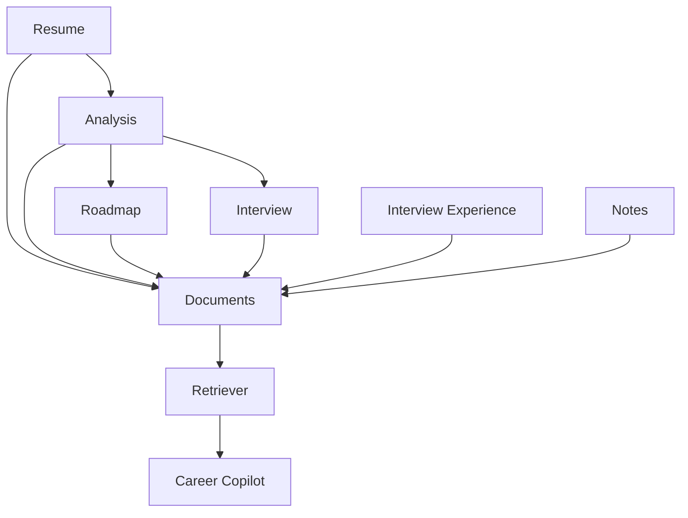
---

# Example User Journey

A typical workflow looks like this.

```text
Register

↓

Login

↓

Upload Resume

↓

Create Job Description

↓

Generate Analysis

↓

Generate Roadmap

↓

Generate Interview

↓

Write Notes

↓

Save Interview Experiences

↓

Ask Career Copilot
```

Each step contributes additional knowledge to the database.

---

# Data Consistency

Career Copilot maintains consistency through:

* Foreign key constraints
* User ownership validation
* Transactional database operations
* Automatic timestamp tracking
* Controlled AI persistence

These measures ensure that relational data and AI-generated data remain synchronized.

---

# Normalization

The schema is normalized to reduce redundancy.

For example,

Conversation metadata and chat messages are stored in separate tables.

Similarly,

Analyses, roadmaps, and interviews are distinct entities rather than embedding all information into a single table.

Benefits include:

* Easier maintenance
* Smaller updates
* Reduced duplication
* Better scalability

---

# Summary

The database schema combines traditional relational modeling with semantic vector storage.

Structured entities capture the application's core business data, while the unified `documents` table powers Retrieval-Augmented Generation.

This hybrid design enables Career Copilot to deliver personalized AI experiences without sacrificing data integrity, maintainability, or scalability.

---


