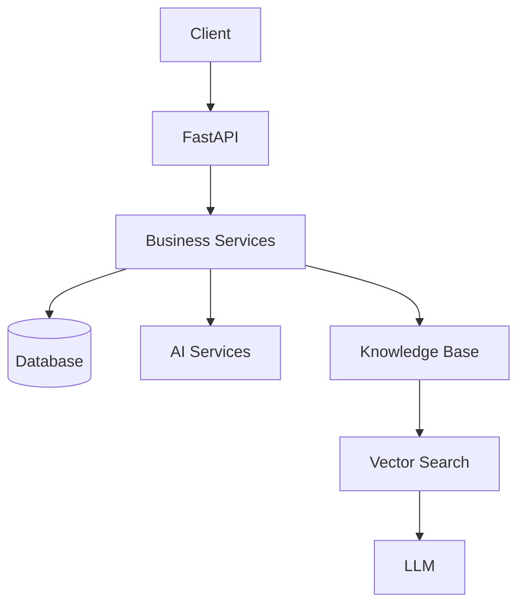
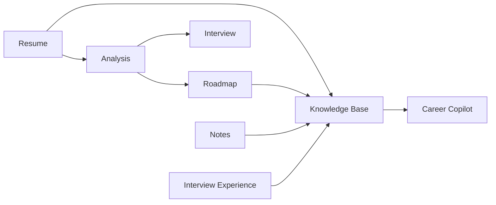
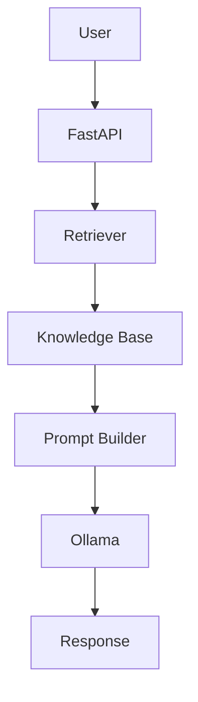
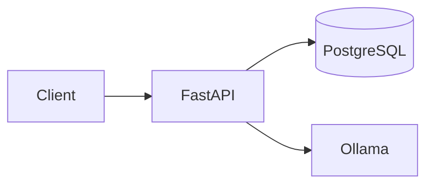
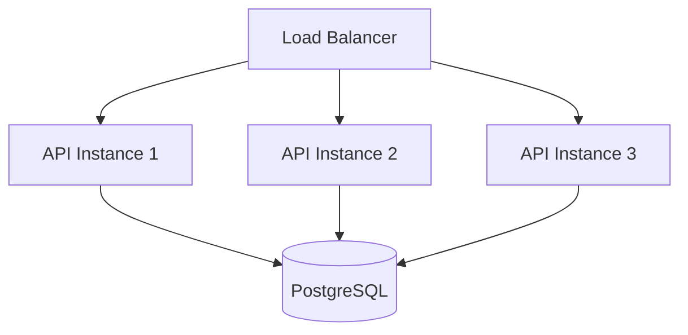

# 🏛️ System Design

This document explains the engineering decisions behind Career Copilot.

Rather than simply describing the implementation, it answers the question:

> **Why was the system designed this way?**

Every architectural choice was made after considering scalability, maintainability, simplicity, and the requirements of an AI-powered backend.

---

# 📑 Table of Contents

* Design Goals
* High-Level Design
* Architectural Principles
* Technology Selection
* Data Flow
* AI Pipeline
* RAG Design
* Scalability
* Trade-offs
* Future Improvements

---

# 🎯 Design Goals

Career Copilot was designed with the following objectives:

* Build a modular backend
* Support AI-powered features
* Keep infrastructure simple
* Minimize repeated AI computation
* Enable semantic retrieval
* Make the system easy to extend
* Maintain strong user isolation
* Keep operational costs low

The architecture intentionally favors simplicity without sacrificing scalability.

---

# 🌍 High-Level Design

Career Copilot follows a layered architecture.



Each layer has a clearly defined responsibility.

---

# Why Layered Architecture?

Separating responsibilities provides several advantages.

Instead of allowing every endpoint to interact directly with the database and AI models,

Career Copilot separates:

* HTTP handling
* Business logic
* Persistence
* Retrieval
* AI generation

Benefits

✅ Easier testing

✅ Easier maintenance

✅ Better readability

✅ Independent feature development

---

# Architectural Principles

Career Copilot follows several software engineering principles.

---

## Single Responsibility Principle

Every module has one primary responsibility.

Examples

Router

↓

Receive HTTP requests

Service

↓

Business logic

CRUD

↓

Database operations

Model

↓

Database representation

Schema

↓

Validation

This separation prevents large, tightly coupled classes.

---

## Separation of Concerns

Business logic never appears inside

* Routers
* SQLAlchemy Models
* Schemas

Instead,

all business rules live inside the service layer.

This makes future refactoring significantly easier.

---

## Modularity

Each feature exists as an independent module.

Examples

Authentication

Resume

Analysis

Roadmap

Interview

Notes

Conversations

Interview Experiences

Adding new modules requires minimal modification to existing code.

---

## Reusability

Several services are reused throughout the project.

Examples

Embedding Generation

Chunking

Prompt Construction

Document Ingestion

Retrieval

Authentication

This avoids duplicated logic.

---

# 🧩 Technology Selection

Career Copilot intentionally uses a small but powerful technology stack.

Each technology was selected for a specific reason.

---

# Why FastAPI?

FastAPI was selected because it provides:

* Excellent performance
* Automatic OpenAPI documentation
* Dependency Injection
* Pydantic validation
* Type safety
* Async support

Compared with traditional Python frameworks,

FastAPI significantly reduces boilerplate while improving developer productivity.

---

# Why PostgreSQL?

Several database options were evaluated.

PostgreSQL was selected because it provides:

* Strong relational support
* JSONB columns
* Mature ecosystem
* Excellent indexing
* pgvector compatibility
* Transaction safety

This allows Career Copilot to store both application data and vector embeddings within the same database.

---

# Why SQLAlchemy?

SQLAlchemy offers:

* ORM abstraction
* Relationship management
* Parameterized queries
* Migration compatibility
* Database independence

Using an ORM simplifies complex relationships while maintaining readable code.

---

# Why Alembic?

Database schemas evolve over time.

Alembic provides

* Version-controlled migrations
* Team collaboration
* Safe schema evolution
* Rollback support

Instead of manually editing databases,

every schema change becomes part of the project's version history.

---

# Why Docker?

Docker ensures every developer runs the same environment.

Advantages

* Consistent PostgreSQL setup
* Easy onboarding
* Simplified deployment
* Reduced configuration issues

One command starts the complete database environment.

---

# Why Ollama?

Career Copilot performs all AI inference locally.

Reasons

* No API costs
* Offline capability
* Full data privacy
* Easy model switching
* Faster experimentation

Developers can replace the chat model by updating a single configuration variable.

---

# Why Local LLMs?

Cloud AI providers require

* Internet connectivity
* API keys
* Usage costs

Local models provide

* Zero inference cost
* Complete control
* Better privacy

This makes Career Copilot accessible to students and developers.

---

# Why pgvector?

Career Copilot requires semantic search.

Several vector databases were considered.

Instead of introducing additional infrastructure,

pgvector allows vectors to be stored directly inside PostgreSQL.

Benefits

* Simpler deployment
* SQL + Vector Search
* Easier backups
* Lower operational complexity

---

# Why Retrieval-Augmented Generation?

Traditional LLMs answer using only their training data.

Career Copilot requires responses grounded in user-specific information.

Retrieval-Augmented Generation provides:

* Personalized answers
* Reduced hallucinations
* Context-aware responses
* Knowledge reuse

Instead of sending every document to the LLM,

only relevant chunks are retrieved.

---

# Data Flow

The following diagram summarizes how information moves through the platform.


---

# AI Design Philosophy

Career Copilot avoids regenerating AI outputs unnecessarily.

Instead,

generated analyses,

roadmaps,

and interview questions

are stored permanently.

Future requests reuse existing knowledge whenever possible.

Benefits

* Faster responses
* Lower inference cost
* Consistent answers
* Searchable history

---

# Summary

Career Copilot combines modern backend engineering practices with practical AI integration.

Every architectural decision—from FastAPI and PostgreSQL to pgvector and Ollama—was selected to balance developer experience, scalability, maintainability, and cost.

The result is a backend platform that is easy to extend, simple to deploy, and capable of delivering personalized AI-powered career guidance.

---

**Next Section:** AI system design, RAG internals, scalability analysis, bottlenecks, and production considerations.
---

# 🤖 AI System Design

Artificial Intelligence is the core capability of Career Copilot.

Unlike traditional backend applications that simply store and retrieve data, Career Copilot transforms structured information into an intelligent knowledge base capable of answering personalized career questions.

The AI layer consists of four major components:

* Prompt Engineering
* Large Language Models (LLMs)
* Embedding Models
* Retrieval-Augmented Generation (RAG)

These components work together to produce accurate, context-aware responses.

---

# AI Architecture



---

# Prompt Engineering

Large Language Models are highly dependent on prompt quality.

Career Copilot constructs prompts dynamically rather than sending raw user input.

Each prompt contains:

* System Instructions
* Retrieved Context
* User Question
* Response Constraints

Example structure

```text
System Prompt

↓

Retrieved Context

↓

User Question

↓

LLM
```

This ensures the model produces responses grounded in the user's data.

---

# System Prompt

Every AI request begins with a system prompt.

Responsibilities include:

* Defining assistant behavior
* Restricting hallucinations
* Maintaining consistent tone
* Keeping responses career-focused

Example responsibilities:

* Provide actionable advice
* Use retrieved context
* Clearly state when information is unavailable

---

# Why Separate System and User Prompts?

Separating prompts provides greater control over model behavior.

Benefits:

* Consistent responses
* Easier experimentation
* Safer AI behavior
* Better prompt maintenance

---

# Embedding Model

Career Copilot uses a dedicated embedding model instead of the chat model.

Current model:

```text
nomic-embed-text
```

The embedding model converts text into dense numerical vectors.

These vectors represent semantic meaning rather than exact wording.

---

# Why Separate Embedding and Chat Models?

Embedding models are optimized for:

* Similarity search
* Semantic understanding
* Retrieval accuracy

Chat models are optimized for:

* Natural language generation
* Explanation
* Reasoning

Using specialized models improves overall performance.

---

# RAG Workflow

Career Copilot implements Retrieval-Augmented Generation (RAG).

The workflow is illustrated below.


---

# Retrieval Strategy

Current retrieval strategy:

* Semantic similarity search
* Top-K retrieval
* User-scoped documents

Only the most relevant chunks are supplied to the LLM.

Advantages:

* Reduced token usage
* Faster responses
* Better factual grounding

---

# Why Top-K Retrieval?

Sending every document to the LLM would:

* Increase latency
* Increase memory usage
* Reduce answer quality

Instead,

Career Copilot retrieves only the most relevant chunks.

This keeps prompts compact while maximizing relevance.

---

# Conversation Context

The assistant also retrieves previous conversation history.

The final prompt contains:

* Previous messages
* Retrieved knowledge
* Current question

This allows Career Copilot to support multi-turn conversations.

---

# AI Output Validation

LLM outputs are validated before persistence.

Examples include:

* JSON parsing
* Required field validation
* Type validation

Malformed responses are rejected instead of being stored.

This improves long-term data quality.

---

# Why Persist AI Outputs?

Career Copilot stores generated analyses, roadmaps, and interviews.

Benefits include:

* No repeated AI computation
* Faster user experience
* Consistent recommendations
* Searchable AI knowledge

Instead of regenerating the same analysis repeatedly,

the platform treats AI output as long-term knowledge.

---

# 📈 Scalability Analysis

Career Copilot is currently optimized for local deployment and development.

However, the architecture supports future horizontal scaling.

Current deployment



---

# Scaling the Backend

Future deployments can introduce multiple API instances.


Benefits:

* Increased throughput
* High availability
* Fault tolerance

---

# Scaling AI Inference

LLM inference is typically the slowest operation.

Future improvements include:

* Dedicated inference server
* GPU acceleration
* Multiple model workers
* Model load balancing

This separates AI computation from API request handling.

---

# Background Processing

Certain tasks are computationally expensive.

Examples:

* Embedding generation
* Knowledge base rebuilding
* OCR processing

Instead of executing synchronously,

future versions can process these jobs in the background.

Recommended technologies:

* Celery
* Redis Queue (RQ)
* Dramatiq

---

# Caching Strategy

Frequently accessed information can be cached.

Potential cache targets:

* User profile
* Resume metadata
* Frequently retrieved conversations
* Retrieved document chunks

Recommended cache:

```text
Redis
```

Benefits:

* Reduced database load
* Faster response times

---

# Potential Bottlenecks

As the platform grows, several areas may require optimization.

## AI Inference

LLM response generation is CPU/GPU intensive.

Mitigation:

* GPU acceleration
* Model optimization
* Streaming responses

---

## Vector Search

Large document collections increase retrieval time.

Mitigation:

* Vector indexing
* Metadata filtering
* Hybrid retrieval

---

## Database Growth

Increasing users produce more documents and embeddings.

Mitigation:

* Table partitioning
* Index optimization
* Archive old conversations

---

# Reliability

Career Copilot emphasizes predictable behavior.

Recommended production features:

* Structured logging
* Centralized error handling
* Retry mechanisms
* Health checks
* Request tracing

These features improve debugging and operational stability.

---

# Security Considerations

The current design already includes:

* JWT authentication
* Password hashing
* User ownership validation
* SQL injection protection
* File type validation

Future improvements may include:

* Refresh tokens
* Rate limiting
* Audit logging
* API keys
* HTTPS enforcement
* Secret rotation

---

# Future System Improvements

The architecture was intentionally designed for extension.

Potential enhancements include:

## AI

* Hybrid Retrieval
* Cross-Encoder Reranking
* Multi-Model Routing
* Response Citations
* Streaming Responses

---

## Backend

* Redis
* Celery
* Async database operations
* Pagination
* Advanced filtering

---

## Infrastructure

* Kubernetes
* GitHub Actions
* Docker Compose Production
* AWS Deployment
* Monitoring with Prometheus

---

## Product Features

* ATS Resume Scoring
* Resume Rewriting
* Job Application Tracker
* Learning Progress Dashboard
* Company Research Assistant
* Certification Tracking
* Email Integration

---

# Key Engineering Takeaways

Career Copilot demonstrates several modern backend engineering concepts.

✅ Layered Architecture

✅ Service-Oriented Design

✅ Dependency Injection

✅ SQLAlchemy ORM

✅ Alembic Database Migrations

✅ JWT Authentication

✅ Retrieval-Augmented Generation

✅ Vector Search

✅ Prompt Engineering

✅ Local LLM Integration

✅ Persistent Conversation Memory

✅ Modular Feature Design

---

# Conclusion

Career Copilot was designed to balance software engineering best practices with practical AI integration.

Rather than treating AI as an isolated feature, the platform integrates it throughout the application using a Retrieval-Augmented Generation architecture, a unified knowledge base, and persistent conversation memory.

The result is a modular backend that is easy to extend, cost-effective to operate using local language models, and capable of delivering personalized, context-aware career guidance grounded in each user's own data.

The architectural decisions documented here provide a foundation for future enhancements while keeping the current implementation maintainable and approachable for contributors.

---

